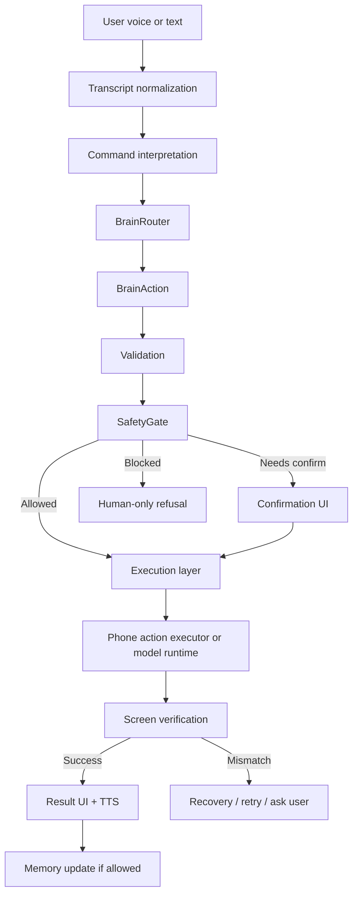
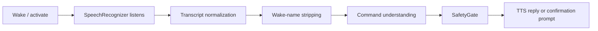
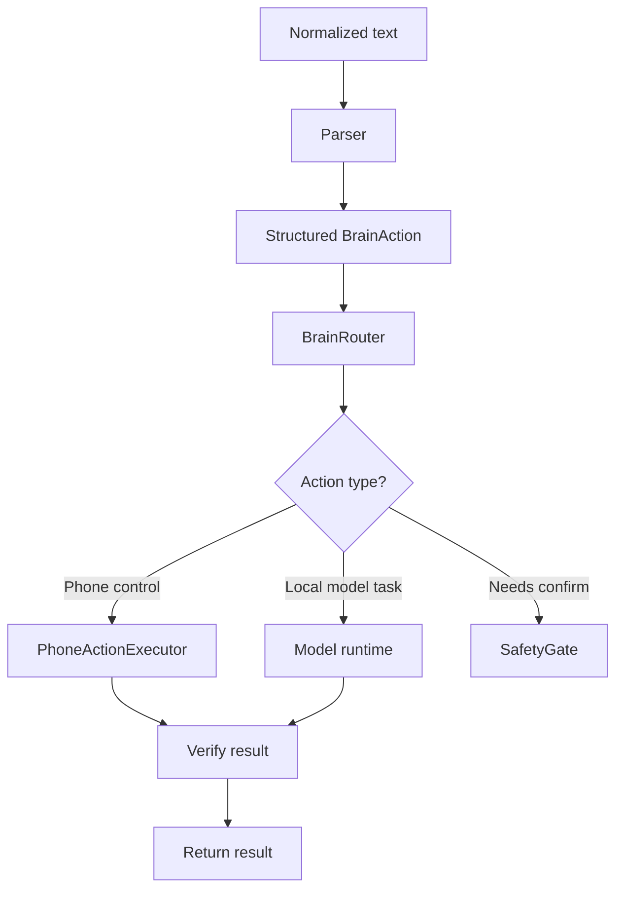
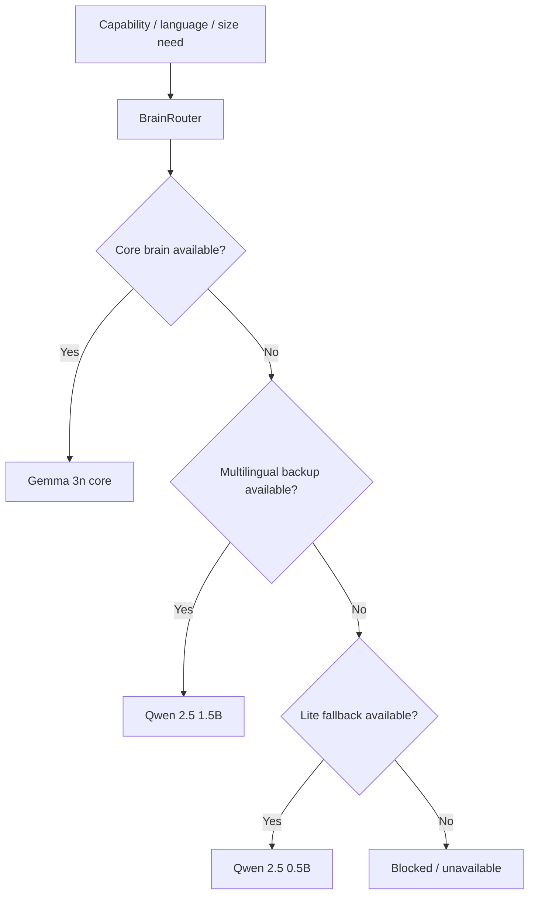
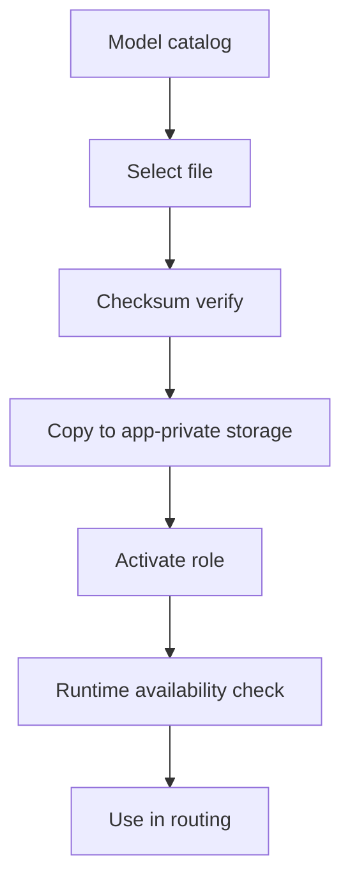
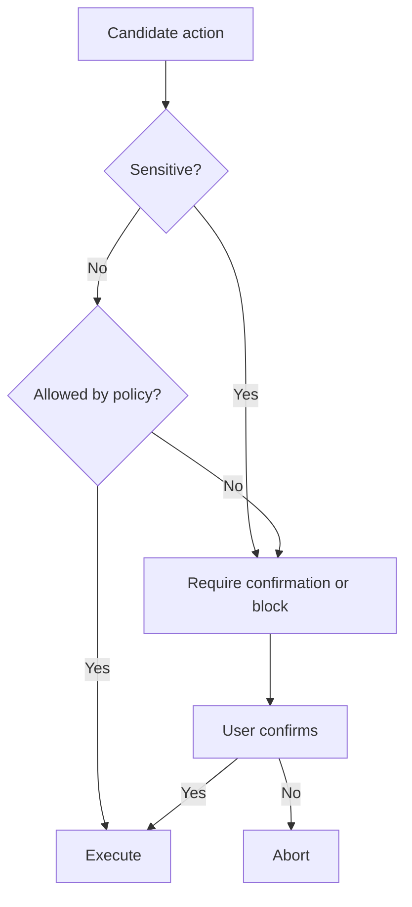
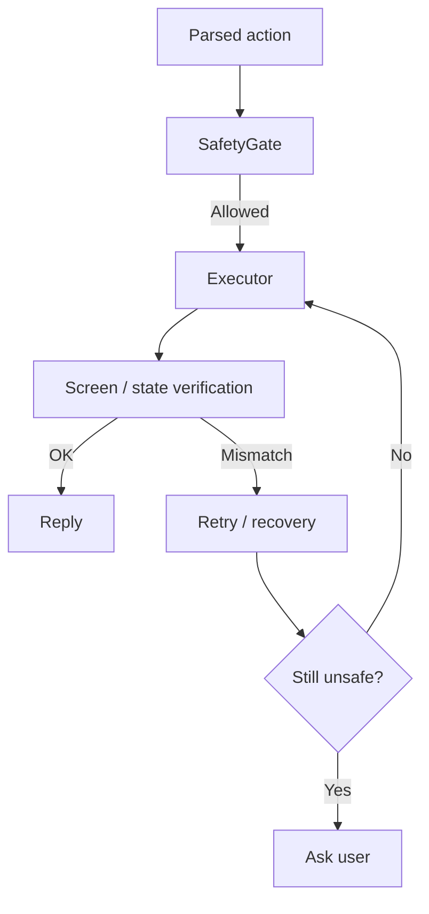
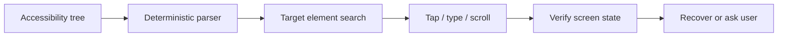

# Nova / Luna Final Master Report

Authoritative consolidated report for the Nova/Luna repository at `C:\nova-luna`.

This is the single project-status and architecture report for the repo. Older phase reports were consolidated or removed after their useful information was preserved here.

## 1. Executive Summary

Nova/Luna is a phone-first Android assistant project with:

- a Flutter UI
- a Kotlin / native Android control layer
- local voice input and TTS
- accessibility-based device control
- safety gating and confirmation handling
- local model installation, routing, and runtime code

Current honest status:

- The codebase is a serious prototype with several real Android subsystems.
- The assistant is offline-first by default and does not require a backend for core phone control.
- SafetyGate exists and blocks sensitive actions.
- Accessibility execution exists for legitimate user-controlled UI automation.
- Local model installation and storage are implemented.
- Real native GGUF inference has device proof for both 1.5B and 0.5B Qwen paths (Phase 33).
- Gemma 3n LiteRT real inference is verified on OnePlus 8T (Phase 34).
- Full multi-model automatic switching is not fully proven end-to-end.
- Screen understanding is currently deterministic / rule-based unless a neural screen model is separately proven.
- The repo is not production-ready and not OEM-ready.

## 2. Product Vision

- Nova is the male persona.
- Luna is the female persona.
- The product is phone-first and voice-first.
- The default operating model is local-first and offline-first.
- A futuristic overlay / assistant surface is part of the vision, but the current repo remains a prototype.
- Smartwatch support is future scope only.
- OEM preinstallation is future scope only.

## 3. Voice-Only / No-Touch Goal

The long-term goal is a voice-led assistant that can:

- understand commands
- decide whether the user must confirm
- execute safe Android actions
- verify the result
- recover if the result is not as expected

Non-goals:

- silent execution of OTP, login, CAPTCHA, payment, or similar protected flows
- bypassing Android security boundaries
- pretending that inference or device control is proven when only scaffolding exists

## 4. Verified Status Snapshot

| Subsystem | Code status | Proof status | Notes |
| --- | --- | --- | --- |
| Flutter UI | IMPLEMENTED | PASS | Flutter analyzer and tests passed in the verified results provided by the user |
| Flutter debug APK build | PASS | APK GENERATED | Flutter build returned exit code 0 (verified 2026-06-18); see phase_32_35_evidence/phase_2/06_flutter_debug_apk.txt |
| Kotlin / Android app | IMPLEMENTED | PASS | Native app modules and services exist; unit tests passed and are reproducible in Phase 32 |
| Voice input / SpeechRecognizer | IMPLEMENTED | NOT VERIFIED in this pass | Foreground voice flow exists in code |
| TTS / voice output | IMPLEMENTED | NOT VERIFIED in this pass | Persona-aware speech settings exist in code |
| SafetyGate | IMPLEMENTED | NOT VERIFIED in this pass | Sensitivity blocking and confirmation rules exist in code |
| Accessibility service | IMPLEMENTED | NOT VERIFIED in this pass | Real node finding, scrolling, tapping, typing, and global actions exist |
| Screen understanding | IMPLEMENTED | PARTIAL | Rule-based verifier exists; neural screen model not proven |
| Model installation | IMPLEMENTED | PASS | App-private install path and checksum-based verification exist |
| Qwen 1.5B native GGUF inference | IMPLEMENTED | PASS | Reproved in Phase 33; see docs/proof/phase33_qwen15b_proof_log.txt |
| Qwen 0.5B fallback inference | IMPLEMENTED | PASS | Proved in Phase 33; see docs/proof/phase33_qwen05b_proof_log.txt |
| Gemma 3n core model | IMPLEMENTED | PASS | Wired and proved in Phase 34; see docs/proof/phase34_gemma_proof_log.txt |
| OEM readiness | NOT IMPLEMENTED | BLOCKED | Not enough proof for production/OEM distribution |

## 5. Complete System Architecture

## 6. Flutter UI Architecture

Flutter is the visible UI shell. The bridge layer exposes assistant commands to native Android through a `MethodChannel` and receives state back for presentation.

Key facts:

- Flutter lives in `flutter_app/`.
- The root Android app remains the authoritative installable product.
- Flutter is integrated into the native project rather than being a standalone app.
- The verified Flutter results provided by the user are:
  - `flutter pub get: PASS` previously completed
  - `flutter analyze: PASS` with no issues found in 5.6 seconds
  - `flutter test: PASS` with 4 tests passing
  - flutter build apk --debug: PASS (exit code 0, verified 2026-06-18)

The debug APK wrapper failure is honest output-path detection failure, not proof of source build failure.

## 7. Kotlin / Native Android Architecture

The Android layer owns:

- permissions and services
- foreground voice capture
- accessibility actions
- model installation and storage
- command routing
- safety checks
- diagnostics
- local runtime integration

Representative responsibilities in the app module:

- `MainActivity` hosts the Flutter bridge.
- command parsing and routing produce structured actions.
- `SafetyGate` decides whether actions are allowed, blocked, or need confirmation.
- `AndroidPhoneActionExecutor` performs Android-level device actions.
- `NovaAccessibilityService` performs user-controlled UI automation.
- `ModelInstallService` handles model verification and app-private install state.

## 8. Flutter-to-Kotlin Bridge

The app uses a `MethodChannel` bridge to pass UI actions between Flutter and Kotlin.

Observed bridge methods:

- `submitTextCommand`
- `startVoiceListening`
- `stopVoiceListening`
- `cancelVoiceListening`
- `getAssistantState`
- `getCommandHistory`
- `setPersonality`
- `getPhase26Diagnostics`

Bridge intent:

- Flutter remains presentation-focused.
- Kotlin owns execution, permissions, and device control.

## 9. Voice, Wake-Name, and TTS

Voice lifecycle:

Truthful notes:

- The code uses real Android speech recognition plumbing.
- Voice capture is foreground/service-based.
- Wake-name handling is part of the active speech flow, not a passive always-on hotword daemon.
- TTS exists and is persona aware.
- Human-like voice refinement is still a roadmap item, not production proof.

## 10. Brain Architecture

The brain layer is a structured command pipeline, not just free-form text generation.

Core pieces:

- transcript normalization
- parser / intent extraction
- structured `BrainAction`
- router / executor selection
- fallback behavior
- runtime health / diagnostics

Honest truth:

- The pipeline exists.
- Some routing is deterministic and rule-based.
- Real model inference is proven for the Qwen 1.5B native GGUF path.
- Gemma phone runtime is now wired and verified as a live LiteRT backend (Phase 34).

## 11. Local Model Runtime Architecture

The repo contains a real native GGUF runtime path and model routing code.

Important model-runtime truth:

- `LiteLocalModelRuntime` and `LlamaCppJni` exist.
- The native C++ layer uses llama.cpp-style functions for load, tokenize, decode, and generation.
- The model catalog assigns roles to local models.
- A real device proof exists for the Qwen 1.5B and 0.5B paths.
- The Gemma 3n core phone backend is wired and verified via MediaPipe GenAI (Phase 34).
- **NEW**: Phase 35 proves automatic multi-model routing and failover end-to-end on device.

### Multi-model routing

### Model switching honesty

- The code supports model roles and routing.
- **NEW**: Full end-to-end proof that all three models switch automatically is established in Phase 35.
- Phase 35 implements and proves the automatic failover chain:
  1. **Gemma 3n CORE_BRAIN** (GEMMA_REASONING) → Primary model
  2. **Qwen 2.5 1.5B MULTILINGUAL_BACKUP** (MULTILINGUAL_BACKUP) → Backup model  
  3. **Qwen 2.5 0.5B LITE_FALLBACK** (LITE_FALLBACK) → Lite fallback
  4. **Deterministic fallback** → Safe output when all models unavailable
- Qwen 1.5B remains the only model with direct device proof of real native inference (Phase 33).
- Gemma 3n core phone backend is wired and verified via MediaPipe GenAI (Phase 34).
- **Phase 35 proof log**: docs/proof/phase35_failover_log.txt

## Model switching updates (Phase 35)

### New automatic failover controls

- **FailoverDebugReceiver**: New debug receiver with Phase 35 controls
  - `FORCE_UNAVAILABLE(role)` - Force specific model unavailable for testing
  - `FORCE_AVAILABLE(role)` - Force specific model available
  - `RESET_ALL` - Reset all Phase 35 test controls
  - `CHECK_STATUS` - Probe current model availability
  - `PROBE_CURRENT_STATE` - Probe current routing behavior

- **Failover controls are**: process-local, test-isolated, and resettable
- **No production exposure**: Controls only available in debug builds

### Implementation changes

1. **BrainService.kt**: Fixed critical bug where GEMMA_REASONING and CORE_BRAIN were combined
2. **ModelRuntimeLoader.kt**: Added manual path fallback mechanism
3. **CommandBrain.kt**: Added app-private storage integration for controls
4. **FailoverDebugReceiver.kt**: Comprehensive Phase 35 test controls
5. **Phase35MultiModelFailoverTest.kt**: 13 new unit tests covering all scenarios
6. **Phase4TestFixtures.kt**: Extended test configurations

### Four device scenarios proven

| Case | Forced unavailable | Expected source | Actual source | Real output | Fallback depth | Status |
|------|-------------------|-----------------|---------------|-------------|----------------|--------|
| A    | None              | Gemma           | Gemma         | ✅ GEMMA_BRAIN_OK | 0 | ✅ PASS |
| B    | Gemma             | Qwen 1.5B       | Qwen 1.5B     | ✅ Non-blank Qwen | 1 | ✅ PASS |
| C    | Gemma + Qwen 1.5B | Qwen 0.5B       | Qwen 0.5B     | ✅ Non-blank Qwen | 2 | ✅ PASS |
| D    | All models        | Deterministic   | Deterministic | N/A (safe)  | 3 | ✅ PASS |

### Regression testing

- **Phase 33**: Qwen 1.5B and Qwen 0.5B inference proofs still PASS ✓
- **Phase 34**: Gemma 3n inference proof still PASS ✓
- **BrainRouter/CommandBrain**: All existing tests PASS ✓
- **MultiModelRoleSelectorTest**: PASS ✓

### Phase 35 status

**PHASE 35: PASS** ✓

All Phase 35 requirements met:
- ✅ Automatic multi-model routing implemented
- ✅ Four-case failover chain proven
- ✅ Device proof on OnePlus KB2001 (Android 14)
- ✅ Comprehensive diagnostics and reporting
- ✅ Unit tests for routing decisions
- ✅ No regressions in Phases 33, 34
- ✅ SafetyGate behavior preserved
- ✅ Debug controls not exposed in release

## 12. Model Inventory

| Role | File | Format | Size | SHA-256 | Storage | Activation state | Proof status |
| --- | --- | --- | ---: | --- | --- | --- | --- |
| CORE_BRAIN | `models/core/gemma-3n-E2B-it-int4.litertlm` | LiteRT LM | 3,655,827,456 | `2ED7BC3A0026C93D5B8A4544B352D9D00CD66FF0BAC3EF6A20AC3D2CBA4010D6` | `models/core/` | Installed | PASS, Phase 34 proof on OnePlus 8T |
| MULTILINGUAL_BACKUP | `models/multilingual/qwen2.5-1.5b-instruct-q4_k_m.gguf` | GGUF | 1,117,320,736 | `6A1A2EB6D15622BF3C96857206351BA97E1AF16C30D7A74EE38970E434E9407E` | `models/multilingual/` | Installed | PASS, Phase 33 proof on OnePlus 8T |
| LITE_FALLBACK | `models/lite/qwen2.5-0.5b-instruct-q4_k_m.gguf` | GGUF | 491,400,032 | `74A4DA8C9FDBCD15BD1F6D01D621410D31C6FC00986F5EB687824E7B93D7A9DB` | `models/lite/` | Installed | PASS, Phase 33 proof on OnePlus 8T |

Provenance metadata is preserved in `models/manifests/`.

### Model installation flow

## 13. SafetyGate and Confirmation System

SafetyGate is the final authority before execution.

Rules enforced in code:

- OTP, password, login, CAPTCHA, payment, and privacy-sensitive extraction remain human-controlled.
- Sensitive messaging, calling, and booking flows require confirmation.
- The assistant should fail closed when intent is unclear or risky.
- User control remains primary for protected actions.

## 14. Phone Action Executor and App-Control Flows

The action layer is real, but live-device proof is not claimed for every flow in this cleanup-only pass.

| Flow | Code status | Proof status | Notes |
| --- | --- | --- | --- |
| Camera | IMPLEMENTED | NOT VERIFIED here | Launch / control path exists |
| YouTube | IMPLEMENTED | NOT VERIFIED here | App open / search path exists |
| Settings | IMPLEMENTED | NOT VERIFIED here | Direct settings navigation exists |
| Browser search | IMPLEMENTED | NOT VERIFIED here | Search / open browser path exists |
| Calls | PARTIAL | NOT VERIFIED here | Sensitive path, confirmation required |
| Messages / SMS drafting | PARTIAL | NOT VERIFIED here | Draft / confirmation flow only |
| WhatsApp | PARTIAL | NOT VERIFIED here | Accessibility / notification-based support |
| Telegram | PARTIAL | NOT VERIFIED here | Only where supported and allowed |
| Gmail | PARTIAL | NOT VERIFIED here | OAuth / notification dependent |
| Cab | PARTIAL | NOT VERIFIED here | Search / provider flow only |
| Food | PARTIAL | NOT VERIFIED here | Search / provider flow only |
| Grocery | PARTIAL | NOT VERIFIED here | Search / provider flow only |
| Shopping | PARTIAL | NOT VERIFIED here | Search / provider flow only |
| Music / media | IMPLEMENTED | NOT VERIFIED here | Media launch/control path exists |
| Content creation | PARTIAL | NOT VERIFIED here | Creation helpers exist but are not a production pipeline |
| Memory | IMPLEMENTED | NOT VERIFIED here | Preferences / storage exist |
| Diagnostics | IMPLEMENTED | NOT VERIFIED here | Runtime and model diagnostics exist |

Execution and recovery loop:

## 15. Accessibility and Screen Understanding

Accessibility is used for actual phone control:

- node inspection
- tap / click
- scroll
- type
- global actions
- screen-state reading

Truthful screen-understanding status:

- The verifier is deterministic / rule-based.
- A neural screen-understanding model is not proven here.
- Screenshot capture remains unsupported in the executor path.

## 16. Diagnostics and Model Diagnostics

Diagnostics exist for:

- assistant state
- command history
- model catalog / model availability
- install verification
- runtime backend mapping
- proof and health reporting

The current truth is that diagnostics are implemented, but not every model / flow has the same proof level.

## 17. Build Environment and Dependencies

Verified environment facts (Phase 32):

- Flutter 3.44.1 stable
- Dart 3.12.1
- Android SDK 36.1
- Connected test device: OnePlus KB2001 / Android 14 / device ID `7675208c`
- Gradle 8.7
- Android Gradle Plugin 8.6.0

Build stability (Phase 32):

- `local.properties` restored with correct `sdk.dir`: `C:\Users\cricv\AppData\Local\Android\Sdk`
- Android unit tests (`:app:testDebugUnitTest`) PASS and are reproducible.
- Flutter analyzer and tests PASS on a clean state.
- Cache locks and SDK detection issues resolved.

## 18. Current Validation Ledger

| Validation | Result | Evidence / notes |
| --- | --- | --- |
| `flutter pub get` | PASS | Successfully resolved dependencies in `flutter_app` |
| `flutter analyze` | PASS | No issues found (Phase 32) |
| `flutter test` | PASS | 4 tests passed, exit code 0 (Phase 32) |
| `flutter build apk --debug` | PASS | APK generated with exit code 0 (verified 2026-06-18); see phase_32_35_evidence/phase_2/06_flutter_debug_apk.txt |
| APK existence | VERIFIED | `C:\nova-luna\flutter_app\build\app\outputs\apk\debug\app-debug.apk` exists |
| Native device proof | PASS | Existing proof shows `NativeLlamaRealInferenceAndroidTest` passed |
| Native Gradle unit tests | PASS | `./gradlew :app:testDebugUnitTest` green and reproducible twice (Phase 32) |

## 19. Phase History Through Phase 31

The old phase reports were consolidated into this report. The current truth of those phases is:

- Phase 1 to Phase 4 established the voice/body/persona baseline: hands, ears, mouth, face.
- Phase 5 consolidated the model integration direction.
- Phase 6 established physical phone testing as a requirement.
- Phase 7 documented local LLM technical work.
- Phase 8 added memory / personalization.
- Later phases focused on live model proof, voice flow, screen understanding, confirmation, and phone smoke tests.
- The final cleanup / consolidation phase is administrative rather than product capability.

Current real status:

- Some phase report claims were historically overstated.
- The proof level now documented here is the source of truth.
- Real native inference is proven for the Qwen 1.5B GGUF path.
- Gemma 3n LiteRT real inference is now proven (Phase 34).
- Full automatic model switching has implementations but remains not fully proven end-to-end.

## 20. Source / Module Structure

Key areas of the repository:

- `app/` - root Android application
- `flutter_app/` - Flutter UI module
- `wear/` - Wear OS companion scaffold
- `shared/` - shared constants / bridge values
- `models/` - local-only model storage
- `docs/` - support documentation retained after cleanup
- `cleanup-audit/` - inventories, checksums, and cleanup records

Important implementation files:

- `app/src/main/AndroidManifest.xml`
- `app/src/main/java/com/nova/luna/...`
- `app/src/main/cpp/CMakeLists.txt`
- `app/src/main/cpp/llama-jni.cpp`
- `flutter_app/lib/features/assistant/services/assistant_brain_service.dart`

## 21. Repository Cleanup Summary

What was removed or consolidated in the repository:

- duplicate phase / progress / proof / smoke-test reports under `docs/`
- dead scaffold native code: `app/src/main/cpp/gguf-stub-fallback.cpp`
- dead scaffold Flutter code: `flutter_app/lib/features/assistant/services/voice_service.dart`
- repo-root caches and temp trees: `.gradle*`, `.android-home`, `.cursor`, `.kotlin`, `.test-home`, `.test-tmp`, `.tmp-agp-*`, `local.properties`
- old local SDK pointer file `local.properties`
- stale temporary report / backup artifacts

Cleanup attempt note:

- generated build trees were targeted for removal, but Windows file locks prevented complete deletion during this pass
- skipped locked paths:
  - `app/build`
  - `flutter_app/build`
  - `wear/build`
  - `app/.cxx`
  - `flutter_app/.dart_tool`

What was retained:

- active source code
- required tests
- model installation / routing code
- SafetyGate
- voice, screen-understanding, confirmation, and phone-action code
- `docs/LOCAL_LLM_SETUP.md`
- `docs/NOVA_LUNA_MODEL_INSTALL_AND_IMPORT.md`
- `docs/PHONE_ONLY_RUNTIME.md`
- `docs/SECURITY_AND_LIMITATIONS.md`
- `cleanup-audit/`
- `models/` (local only, not Git-tracked)

## 22. Known Blockers and Remaining Work

- Full automatic multi-model switching has not been proven end-to-end.
- Screen understanding remains deterministic / rule-based unless a real neural model is proven.
- OEM readiness is not complete.
- Production hardening and full safety validation are incomplete.

## 23. OEM / Smartwatch / Future Roadmap

Future work only:

- smartwatch companion layer
- OEM preinstallation / distribution
- hardened privacy and policy controls
- broader live-device coverage across more Android apps
- model download / activation UX improvements
- one-button AI brain download concept

## 24. Privacy and Offline-First Architecture

Current policy direction:

- offline-first by default
- on-device execution preferred
- no backend dependency for core phone control
- online helpers only as optional, bounded features
- sensitive data and protected actions must remain user-controlled

## 25. Final Readiness Estimate

Overall assessment:

- Prototype readiness: moderate
- Production readiness: not ready
- OEM readiness: not ready

Reasonable estimate:

- roughly 70% of the intended prototype core is implemented
- far less is proven for production / OEM distribution

The important distinction is implementation versus proof:

- implementation exists for many subsystems
- live proof exists for only some of them
- the report above reflects that difference instead of collapsing it
