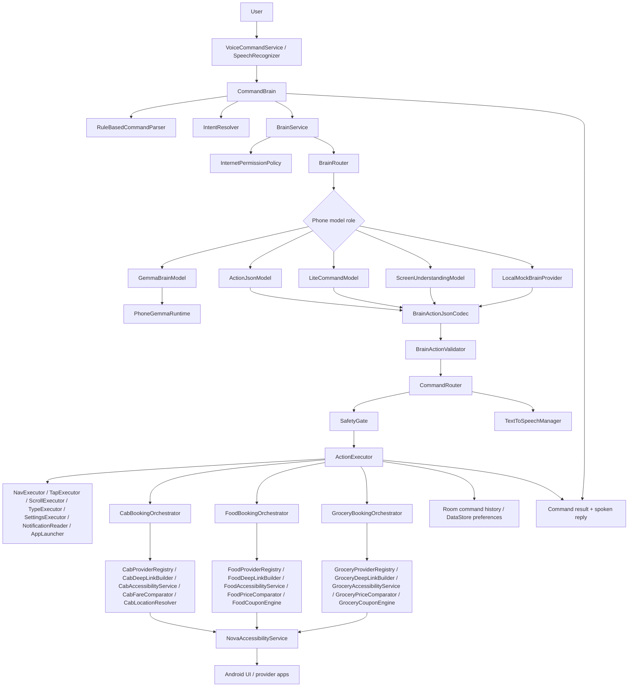

# Nova / Luna A-to-Z Project Report

## 1. Full Project Overview

Nova / Luna is a phone-first Android assistant project that is designed to stay local-first, offline-first, and zero-backend-cost by default. Nova is the male assistant voice profile, and Luna is the female assistant voice profile.

The checked-in implementation in this branch is the native Android assistant runtime. The repository still treats Flutter as the broader front-end direction, but `flutter_app/` remains intentionally untouched in this branch and must stay that way unless a future task explicitly says otherwise.

The current assistant stack includes:

- Local voice capture and local voice reply.
- Structured brain routing with phone-only model roles.
- A final safety gate before executor dispatch.
- Cab booking, food ordering, and grocery booking state machines.
- Local command history, preferences, and lightweight memory.
- Read-only screen-understanding scaffolding.
- Debug-only smoke/test hooks for browserless verification.

The design intent is simple:

- Keep execution on the device.
- Keep remote/cloud dependence out of the default runtime.
- Keep human confirmation in control of final booking, final ordering, and sensitive actions.
- Keep `LocalMockBrainProvider` as the guaranteed fallback.
- Preserve `SafetyGate` as the final authority before anything reaches `ActionExecutor`.

## 2. Complete Architecture Diagram



## 3. Every Brain / Model Component And Its Role

### Core brain orchestration

| Component | Role |
|---|---|
| `CommandBrain` | Entry point for user text; handles stop commands, pending confirmations, active sessions, and delegates to `BrainService` and `CommandRouter`. |
| `CommandRouter` | Final routing layer that converts a `BrainAction` or `CommandIntent` into an execution decision after `SafetyGate` approval. |
| `BrainService` | Owns brain-provider selection, model-role routing, validation, fallback, and diagnostics for the structured brain stack. |
| `BrainRouter` | Chooses the phone model role for a request: Gemma reasoning, structured action JSON, lightweight commands, screen understanding, or fallback. |
| `RuleBasedCommandParser` | Fast rule parser for direct command detection and some domain-intent shortcuts. |
| `IntentResolver` | Intent-resolution helper used to refine routing and command interpretation before execution. |
| `BrainRequest` | Captures the raw input plus session context such as active cab or grocery session flags. |
| `BrainDiagnostics` | Debug snapshot of the routing, model output, validation, fallback, and safety state for a request. |
| `BrainProviderFactory` | Creates the runtime provider selection based on build/runtime configuration, internet availability, and phone provider availability. |
| `BrainRuntimeConfig` | Local configuration input for the brain runtime mode and provider policy. |
| `BrainRuntimeSelection` | Encodes which provider/role path is selected at runtime. |
| `BrainSystemPrompt` | Houses the structured instruction style used by the brain stack. |
| `BrainActionJsonCodec` | Encodes and decodes structured `BrainAction` JSON. |
| `BrainActionValidator` | Rejects invalid, unsafe, or malformed model output before it can reach execution. |
| `NetworkAwareBrainSelector` | Chooses brain behavior based on internet availability and local capability mode while keeping execution local-first. |
| `InternetPermissionPolicy` | Classifies requests as blocked-sensitive, info-lookup-only, or allowed. |
| `LocalBrainInterpreter` | Local interpretation layer that supports structured command understanding without a cloud dependency. |

### Phone-only model and provider layer

| Component | Role |
|---|---|
| `BrainProvider` | Common provider contract for the brain runtime and fallback implementations. |
| `PhoneBrainModel` | Interface for phone-only model roles. |
| `PhoneBrainProvider` | Interface for provider-style phone-model execution. |
| `GemmaBrainModel` | Production phone-reasoning model wrapper that delegates to `PhoneGemmaRuntime` when ready. |
| `PhoneGemmaRuntime` | On-device Gemma runtime scaffold and readiness reporting path for the phone-only future. |
| `ActionJsonModel` | Strict structured-output model for cab, food, grocery, and planning actions. |
| `LiteCommandModel` | Fast offline command model for stop, cancel, go home, open app, and similar quick actions. |
| `ScreenUnderstandingModel` | Read-only screen-analysis model used for future or limited screen-query requests. |
| `LocalMockBrainProvider` | Guaranteed fallback provider that preserves offline behavior when a real model is unavailable or rejected. |
| `LocalLlmBrainProvider` | Optional local LLM provider path, intended for dev-only Ollama-compatible use. |
| `UnavailablePhoneBrainProvider` | Stub provider used when a phone model path is not currently available. |
| `OllamaClient` | Client abstraction for local Ollama-compatible LLM calls. |
| `HttpOllamaClient` | HTTP implementation of the optional local Ollama-compatible client. |
| `GemmaPhoneConfig` | Phone Gemma runtime configuration values and readiness inputs. |

### Brain and policy value types

| Component | Role |
|---|---|
| `BrainAction` | Structured action candidate produced by the model layer. |
| `BrainActionType` | High-level action category for a brain candidate. |
| `BrainModelRole` | Selected role for the brain router, such as Gemma reasoning, action JSON, lite command, screen understanding, or mock fallback. |
| `BrainRiskLevel` | Risk classification used to determine whether confirmation or blocking is required. |
| `BrainRouteDecision` | Result of the routing step that says which model role should handle the request. |
| `BrainRuntimeStatus` | Runtime readiness and selection state for the current brain configuration. |
| `BrainModelResult` | Result object returned by a phone model implementation. |
| `BrainCapabilityMode` | Local capability mode for the phone brain stack. |
| `VoiceProfile` | Voice identity and narration profile used by spoken responses. |
| `CommandIntent` | Structured executor-facing command derived from either rule parsing or a brain action. |
| `CommandResult` | Final result object returned to the UI/brain loop, including confirmation and safety metadata. |
| `ActionType` | Executor action enum for navigation, settings, cab, food, grocery, and control actions. |
| `IntentType` | Intent classification enum mirrored in the command and safety layers. |
| `SafetyDecision` | Result of a safety evaluation, including human-only and confirmation metadata. |
| `SafetyLevel` | Safety tier enum used by `SafetyDecision`. |
| `InternetPermissionCategory` | Internet policy category for a request. |
| `InternetPermissionDecision` | Decision object returned by the internet permission policy. |

## 4. Full Command Flow From User Input To Execution

1. The user speaks or types a request into the voice command flow.
2. `VoiceCommandService` and Android speech capture produce raw text.
3. `CommandBrain.process()` trims the input, rejects blank text, and handles explicit stop/listening commands first.
4. `CommandBrain` also checks for a pending confirmation reply and routes confirm/decline responses before any new action is started.
5. If a food order session is already active, `CommandBrain` continues that food session through the dedicated food path.
6. If there is no active cab or grocery session and the parser sees a direct food-order request, `CommandBrain` routes it immediately instead of waiting for the full brain pipeline.
7. Otherwise, `CommandBrain` calls `BrainService.process()` with the current session context.
8. `BrainService` builds a `BrainRequest`, classifies internet permissions, and either blocks sensitive internet use or allows lookup-only handling when appropriate.
9. `BrainRouter` selects the best phone model role for the request.
10. The selected model emits a candidate `BrainAction`.
11. `BrainActionJsonCodec` and `BrainActionValidator` ensure the output is structured and safe enough to consider.
12. If the selected model output is missing, invalid, or rejected, the stack falls back to `LocalMockBrainProvider`.
13. `CommandRouter` receives the resulting `BrainAction` or `CommandIntent`.
14. `SafetyGate` evaluates that candidate before anything is allowed to touch execution.
15. If the result requires confirmation, `CommandRouter` returns a confirmation result and `CommandBrain` stores the pending action.
16. If the result is human-only or blocked, the action never reaches the executor.
17. If the result is allowed, `ActionExecutor` performs the direct device action or hands the request to the cab, food, or grocery orchestrator.
18. The final `CommandResult` is spoken locally and recorded in local history.

## 5. SafetyGate And Confirmation Flow

`SafetyGate` is the final authority before executor dispatch.

### Direct command path

- `SafetyGate.evaluate(CommandIntent)` handles direct executor-facing commands.
- Stop commands are allowed so the assistant can shut down listening safely.
- Direct cab, food, and grocery booking actions are allowed only as planning and handoff actions; the final booking or order tap remains manual.
- Payment, banking, OTP, password, CAPTCHA, checkout, and similar final-step intents are blocked or forced to stay human-only.
- `CALL_CONTACT` and `TAKE_SCREENSHOT` are treated as sensitive and require biometric confirmation in the direct-command path.
- `OPEN_SETTINGS`, `OPEN_ACCESSIBILITY_SETTINGS`, and the correct usage-access flow are allowed when the text clearly matches the intended settings action.

### Brain-action path

- `SafetyGate.evaluate(BrainAction, userConfirmed)` handles structured actions emitted by the brain stack.
- `BrainActionType.HUMAN_ONLY` and blocked-risk actions are returned as human-only decisions.
- Confirmation-required actions become `SafetyDecision.requireConfirmation(...)`.
- Grocery and food actions that include sensitive substeps such as payment, OTP, login, or CAPTCHA are forced back to manual handling.
- Dangerous final-step wording is rejected when the action is not marked as safe for final execution.

### Confirmation plumbing

- `SafetyDecision` carries `allowed`, `requiresBiometric`, `requiresConfirmation`, `finalActionAllowed`, and `humanRequired`.
- `CommandRouter` turns those decisions into `CommandResult.confirmationRequired(...)`, `CommandResult.biometricRequired(...)`, or blocked results.
- `CommandBrain` keeps one `pendingConfirmationAction` and only resumes that action when the user explicitly confirms.
- Declines cancel the pending action instead of letting it continue.

This is why the repo still guarantees:

- No autonomous phone control.
- No automatic payment or OTP entry.
- No automatic login or CAPTCHA bypass.
- No final cab, food, or grocery action without explicit user confirmation.

## 6. Cab Booking A-To-Z Flow

1. The user asks for a cab, a ride comparison, or an update within an active cab session.
2. `RuleBasedCommandParser` and the brain-routing path classify the request as cab planning.
3. `CommandRouter` and `SafetyGate` allow cab planning but keep the final booking tap manual.
4. `ActionExecutor` routes the command to `CabBookingOrchestrator`.
5. `CabBookingOrchestrator` starts or continues the cab session and progresses through:
   - `PARSING_REQUEST`
   - `NEED_PICKUP`
   - `NEED_DROP`
   - `NEED_RIDE_TYPE`
   - provider comparison
   - provider choice
   - final confirmation
   - manual-action handling
   - success / failure / cancellation states
6. `CabLocationResolver` can resolve a current-location pickup when the device and permission state support it.
7. `CabProviderRegistry` checks installed provider apps locally.
8. The supported cab providers are Uber, Ola, Rapido, and inDrive.
9. `CabDeepLinkBuilder` opens the chosen provider app or falls back to a suitable launch plan.
10. `CabAccessibilityService` reads visible fare, ETA, coupon, and other screen text, fills safe fields, and stops on OTP, login, payment, CAPTCHA, and other manual-action screens.
11. `CabFareComparator` normalizes and sorts fare options.
12. `CabBookingModels` converts the request/session/results into structured entities for command history and speech output.
13. Debug-only `CabSmokeReceiver` validates the flow without performing the final booking or payment action.
14. The final booking tap always waits for explicit user confirmation.

## 7. Food Ordering A-To-Z Flow

1. The user asks for food, a meal, a restaurant order, or an update within an active food session.
2. `BrainRouter` detects food planning and typically selects `ActionJsonModel` for structured safe output.
3. `CommandBrain` also routes active food-session follow-ups directly through the food path.
4. `ActionExecutor` sends the request to `FoodBookingOrchestrator`.
5. `FoodBookingOrchestrator` progresses through:
   - `IDLE`
   - `NEED_FOOD_ITEM`
   - `NEED_RESTAURANT`
   - `OPENING_PROVIDERS`
   - `COLLECTING_QUOTES`
   - `SHOWING_COMPARISON`
   - `WAITING_FOR_PLATFORM_CHOICE`
   - `WAITING_FOR_FINAL_CONFIRMATION`
   - `PREPARING_ORDER`
   - `PLACING_ORDER`
   - `COMPLETED`
   - `FAILED`
   - `CANCELLED`
   - `MANUAL_ACTION_REQUIRED`
6. `FoodProviderRegistry` checks the installed food providers locally.
7. The supported food providers are Swiggy, Zomato, and Toings.
8. `FoodDeepLinkBuilder` opens the provider app or its launch fallback.
9. `FoodAccessibilityService` reads visible screen text, waits for the provider foreground, fills search/order details, applies safe coupons, and collects quote data.
10. `FoodPriceComparator` normalizes price and quote comparisons.
11. `FoodCouponEngine` extracts and ranks safe coupon candidates.
12. `FoodBookingVoiceResponses` provides the spoken prompts and completions used by the food flow.
13. Manual-action screens such as payment, OTP, login, CAPTCHA, and password boundaries stop the automation.
14. The final order tap is only allowed after explicit user confirmation.

## 8. Grocery Booking A-To-Z Flow

1. The user asks for grocery shopping, basket editing, comparison, or follow-up updates within an active grocery session.
2. `BrainRouter` detects grocery planning and routes it to the structured action path.
3. `CommandRouter` passes the resulting action through `SafetyGate` before any execution or session continuation.
4. `ActionExecutor` sends the request to `GroceryBookingOrchestrator`.
5. `GroceryBookingOrchestrator` progresses through:
   - `IDLE`
   - `PARSING_REQUEST`
   - `NEED_ITEMS`
   - `NEED_BRAND`
   - `CHECKING_PROVIDERS`
   - `OPENING_PROVIDER`
   - `SEARCHING_PROVIDER`
   - `ADDING_ITEMS`
   - `APPLYING_COUPON`
   - `COLLECTING_CART`
   - `SHOWING_COMPARISON`
   - `WAITING_FOR_PROVIDER_CHOICE`
   - `WAITING_FOR_FINAL_CONFIRMATION`
   - `BOOKING`
   - `COMPLETED`
   - `CANCELLED`
   - `FAILED`
   - `MANUAL_ACTION_REQUIRED`
6. `GroceryProviderRegistry` checks the installed grocery providers locally.
7. The supported grocery providers are Blinkit, JioMart, and Instamart.
8. `GroceryDeepLinkBuilder` opens provider apps or fallback launch targets.
9. `GroceryAccessibilityService` reads cart totals, ETA, coupon, unavailable-item, and replacement-item text, searches for items, applies safe coupons, and captures cart summaries.
10. `GroceryPriceComparator` normalizes and ranks cart candidates by payable value, ETA, coupon state, and penalties.
11. `GroceryCouponEngine` handles coupon extraction and safe coupon application support.
12. `GroceryBookingVoiceResponses` supplies the spoken prompts, comparison summaries, and completion messages.
13. Manual-action screens such as payment, OTP, login, CAPTCHA, address friction, replacement selection, and unavailable-item states stay human-only.
14. The final order tap is only allowed after explicit user confirmation.

## 9. Accessibility And Screen-Understanding Layer

The assistant uses the Android accessibility stack as a controlled execution surface, not as a silent autonomy layer.

### Main accessibility surfaces

- `NovaAccessibilityService` is the shared Android execution surface for global actions, text entry, and node interaction.
- `CabAccessibilityService` is the cab-specific inspector and interaction layer.
- `FoodAccessibilityService` is the food-specific inspector and interaction layer.
- `GroceryAccessibilityService` is the grocery-specific inspector and interaction layer.

### Supported accessibility behaviors

- Go home.
- Go back.
- Open recents.
- Open notifications.
- Click or tap by text / description.
- Scroll forward and backward.
- Type into focused fields.
- Read notification text scaffolding.

### Screen understanding

- `BrainRouter` can select `ScreenUnderstandingModel` for read-only screen-query requests.
- `ScreenUnderstandingModel` is read-only only; it is not allowed to execute device actions.
- Screen-understanding support is intentionally separated from action execution so that visual inspection never turns into hidden autonomy.

### Why this matters

- The accessibility layer is used for user-requested, bounded interactions.
- Domain services stop on manual-action screens.
- No accessibility helper is permitted to bypass payment, OTP, login, or CAPTCHA boundaries.

## 10. Local-Only / Offline-First Model Strategy

The model strategy is explicitly local-first.

### Default strategy

- Prefer on-device logic before any remote service.
- Do not require a backend, cloud API, or paid service by default.
- Keep remote-like behavior dev-only or lookup-only when it is unavoidable.

### Core phone model roles

- `GemmaBrainModel` is the production phone-reasoning direction.
- `PhoneGemmaRuntime` is the runtime scaffold behind that direction.
- `ActionJsonModel` generates strict structured output for cab, food, grocery, and task planning.
- `LiteCommandModel` handles quick offline commands.
- `ScreenUnderstandingModel` stays read-only.
- `LocalMockBrainProvider` is the guaranteed fallback.

### Optional / dev-only local LLM path

- `LocalLlmBrainProvider` is present as an optional local LLM path.
- `OllamaClient` and `HttpOllamaClient` keep that path explicit and local.
- `BrainRuntimeConfig`, `BrainRuntimeSelection`, `BrainProviderFactory`, and `NetworkAwareBrainSelector` keep the mode switch local and visible.
- `BrainActionValidator` and `SafetyGate` still gate the output before execution.

### Internet policy

- `InternetPermissionPolicy` separates blocked-sensitive requests from information-lookup-only requests.
- If the requested info is unavailable offline, the assistant can stay lookup-only without adding a backend dependency.
- Internet access does not bypass safety or execution controls.

### Local configuration

- `brain_provider`
- `llm_enabled`
- `ollama_base_url`
- `ollama_model`
- `brain_capability_mode`

These remain local configuration knobs, not hidden cloud assumptions.

## 11. Current Test / Build Status

Latest validation on the current branch:

```powershell
.\gradlew.bat :app:testDebugUnitTest --no-daemon
.\gradlew.bat :app:assembleDebug --no-daemon
.\gradlew.bat :app:installDebug --no-daemon
```

Result:

- JVM unit tests passed.
- Debug build passed.
- Debug install passed on the connected KB2001 / Android 14 device.
- Sectioned phone smoke reruns passed for wake-word stripping, cab routing, food flow startup, grocery flow startup, and negative safety boundaries.

The repo therefore remains in a validated state after this code and documentation change set.

## 12. File / Module Inventory

### Build and configuration

| Module / path | Key files | Role |
|---|---|---|
| Root build config | `app/build.gradle`, `gradle.properties` | Android app build configuration, feature flags, and local brain/runtime configuration inputs. |
| Debug configuration | `app/src/debug/AndroidManifest.xml`, `app/src/debug/java/com/nova/luna/brain/BrainSmokeReceiver.kt`, `app/src/debug/java/com/nova/luna/brain/BrainSmokeLogger.kt`, `app/src/debug/java/com/nova/luna/brain/BrainSmokePhraseCatalog.kt`, `app/src/debug/java/com/nova/luna/cab/CabSmokeReceiver.kt`, `app/src/debug/java/com/nova/luna/smoke/CommandSmokeReceiver.kt` | Debug-only smoke entry points and logging hooks. |

### Brain layer

| Module / path | Key files | Role |
|---|---|---|
| `app/src/main/java/com/nova/luna/brain` | `CommandBrain.kt`, `CommandRouter.kt`, `BrainService.kt`, `BrainRouter.kt`, `RuleBasedCommandParser.kt`, `IntentResolver.kt`, `BrainActionJsonCodec.kt`, `BrainActionValidator.kt`, `BrainProvider.kt`, `BrainProviderFactory.kt`, `BrainDiagnostics.kt`, `BrainRequest.kt`, `BrainRuntimeConfig.kt`, `BrainRuntimeSelection.kt`, `BrainSystemPrompt.kt`, `NetworkAwareBrainSelector.kt`, `InternetPermissionPolicy.kt`, `ActionJsonModel.kt`, `LiteCommandModel.kt`, `GemmaBrainModel.kt`, `PhoneGemmaRuntime.kt`, `LocalMockBrainProvider.kt`, `LocalLlmBrainProvider.kt`, `UnavailablePhoneBrainProvider.kt`, `ScreenUnderstandingModel.kt`, `OllamaClient.kt`, `HttpOllamaClient.kt`, `GemmaPhoneConfig.kt`, `LocalBrainInterpreter.kt` | Structured brain selection, validation, local model roles, and runtime control. |

### Executor and safety layer

| Module / path | Key files | Role |
|---|---|---|
| `app/src/main/java/com/nova/luna/executor` | `ActionExecutor.kt`, `ActionExecutorGateway.kt`, `AppLauncher.kt`, `NavExecutor.kt`, `TapExecutor.kt`, `ScrollExecutor.kt`, `TypeExecutor.kt`, `SettingsExecutor.kt`, `NotificationReader.kt` | Converts safe actions into controlled device operations and domain handoffs. |
| `app/src/main/java/com/nova/luna/safety` | `SafetyGate.kt` | Final safety authority before execution. |
| `app/src/main/java/com/nova/luna/model` | `ActionType.kt`, `IntentType.kt`, `CommandIntent.kt`, `CommandResult.kt`, `BrainAction.kt`, `BrainActionType.kt`, `BrainModelRole.kt`, `BrainRiskLevel.kt`, `BrainRouteDecision.kt`, `BrainRuntimeStatus.kt`, `SafetyDecision.kt`, `SafetyLevel.kt`, `InternetPermissionCategory.kt`, `InternetPermissionDecision.kt`, `BrainCapabilityMode.kt`, `BrainModelResult.kt`, `VoiceProfile.kt` | Shared value objects, enums, and outcome metadata. |

### Domain flows

| Module / path | Key files | Role |
|---|---|---|
| `app/src/main/java/com/nova/luna/cab` | `CabBookingOrchestrator.kt`, `CabBookingModels.kt`, `CabBookingVoiceResponses.kt`, `CabDeepLinkBuilder.kt`, `CabFareComparator.kt`, `CabIntentParser.kt`, `CabLocationResolver.kt`, `CabProviderRegistry.kt`, `CabProviderLauncher.kt`, `CabAccessibilityService.kt`, `CabLogger.kt` | Local cab booking flow, provider discovery, screen inspection, and fare comparison. |
| `app/src/main/java/com/nova/luna/food` | `FoodBookingOrchestrator.kt`, `FoodBookingModels.kt`, `FoodBookingVoiceResponses.kt`, `FoodDeepLinkBuilder.kt`, `FoodPriceComparator.kt`, `FoodIntentParser.kt`, `FoodProviderRegistry.kt`, `FoodProviderLauncher.kt`, `FoodAccessibilityService.kt`, `FoodCouponEngine.kt`, `FoodLogger.kt` | Local food ordering flow, provider discovery, quote comparison, coupon probing, and screen inspection. |
| `app/src/main/java/com/nova/luna/grocery` | `GroceryBookingOrchestrator.kt`, `GroceryBookingModels.kt`, `GroceryBookingVoiceResponses.kt`, `GroceryDeepLinkBuilder.kt`, `GroceryPriceComparator.kt`, `GroceryIntentParser.kt`, `GroceryProviderRegistry.kt`, `GroceryProviderLauncher.kt`, `GroceryAccessibilityService.kt`, `GroceryCouponEngine.kt`, `GroceryLogger.kt` | Local grocery booking flow, basket comparison, coupon support, provider discovery, and screen inspection. |

### Platform and app support

| Module / path | Key files | Role |
|---|---|---|
| `app/src/main/java/com/nova/luna/service` | `VoiceCommandService.kt`, `NovaAccessibilityService.kt`, `BootReceiver.kt`, `NotificationHelper.kt` | Voice lifecycle and shared accessibility/runtime support. |
| `app/src/main/java/com/nova/luna/data` | `AppDatabase.kt`, `CommandHistoryDao.kt`, `CommandHistoryEntity.kt`, `CommandHistoryRecordFactory.kt`, `CustomRuleDao.kt`, `CustomRuleEntity.kt`, `PreferencesManager.kt` | Local Room storage and DataStore preferences. |
| `app/src/main/java/com/nova/luna/history` | `CommandHistoryActivity.kt`, `CommandHistoryFormatter.kt` | Local command-history UI and formatting. |
| `app/src/main/java/com/nova/luna/tts` | `TextToSpeechManager.kt` | Local spoken replies. |
| `app/src/main/java/com/nova/luna/util` | `AccessibilityNodeUtils.kt`, `AssistantTextNormalizer.kt`, `FuzzyMatcher.kt`, `PermissionUtils.kt` | Shared helper utilities. |

### Tests

| Module / path | Key files | Role |
|---|---|---|
| `app/src/test/java/com/nova/luna/util` | `AssistantTextNormalizerTest.kt` | Wake-word stripping and normalization coverage. |
| `app/src/test/java/com/nova/luna/brain` | `BrainActionValidatorTest.kt`, `BrainRouterGroceryTest.kt`, `BrainRouterPhase5Test.kt`, `BrainServicePhase1Test.kt` through `BrainServicePhase6Test.kt`, `CommandBrainFoodOrderTest.kt`, `CommandBrainGoBackTest.kt`, `CommandBrainGoHomeTest.kt`, `CommandBrainNavigationTest.kt`, `CommandBrainNotificationsTest.kt`, `CommandBrainOpenAppTest.kt`, `CommandBrainRecentsTest.kt`, `CommandBrainScrollTest.kt`, `CommandBrainSettingsTest.kt`, `CommandBrainStopListeningTest.kt`, `CommandBrainTapClickTest.kt`, `CommandBrainTypeTextTest.kt`, `CommandBrainUsageAccessSettingsTest.kt`, `CommandRouterGroceryTest.kt`, `CommandRouterSafetyTest.kt`, `FlutterAppIsolationTest.kt`, `InternetPermissionPolicyTest.kt`, `LocalLlmBrainProviderTest.kt`, `NetworkAwareBrainSelectorTest.kt`, `RuleBasedCommandParserCabBookingTest.kt`, `RuleBasedCommandParserGroceryBookingTest.kt` | Brain routing, fallback, safety, and isolation coverage. |
| `app/src/test/java/com/nova/luna/cab` | `CabAccessibilityServiceTest.kt`, `CabAccessibilityServiceManualActionTest.kt`, `CabBookingOrchestratorTest.kt`, `CabDeepLinkBuilderTest.kt`, `CabFareComparatorTest.kt`, `CabIntentParserTest.kt`, `CabProviderRegistryTest.kt`, `CabSafetyGateTest.kt` | Cab-flow safety and state-machine coverage. |
| `app/src/test/java/com/nova/luna/food` | `FoodAccessibilityServiceFinalTapSafetyTest.kt`, `FoodAccessibilityServiceForegroundRetryTest.kt`, `FoodAccessibilityServiceManualActionTest.kt`, `FoodBookingOrchestratorTest.kt`, `FoodCouponEngineTest.kt`, `FoodIntentParserTest.kt`, `FoodPriceComparatorTest.kt`, `FoodProviderRegistryTest.kt` | Food-flow comparison, coupon, and manual-action coverage. |
| `app/src/test/java/com/nova/luna/grocery` | `GroceryIntentParserTest.kt` | Grocery parsing coverage. |
| `app/src/test/java/com/nova/luna/safety` | `FoodSafetyGateTest.kt`, `GrocerySafetyGateTest.kt` | SafetyGate policy coverage for booking flows. |
| `app/src/test/java/com/nova/luna/data`, `app/src/test/java/com/nova/luna/history`, `app/src/test/java/com/nova/luna/model` | DataStore, Room, and model coverage | Local persistence and value-object coverage. |

### Docs

| Module / path | Key files | Role |
|---|---|---|
| `docs/` | `ARCHITECTURE.md`, `CURRENT_ARCHITECTURE_REPORT.md`, `WORK_PROCESS_REPORT.md`, `ROADMAP.md`, `LOCAL_LLM_SETUP.md`, `PHONE_ONLY_RUNTIME.md`, `FINAL_ANDROID_NATIVE_RELEASE_READINESS_REPORT.md`, `SECURITY_AND_LIMITATIONS.md`, `MANUAL_PHONE_TEST_CHECKLIST.md`, `MANUAL_PHONE_TEST_RESULTS.md`, `NOVA_LUNA_PROGRESS_CHECKPOINT.md` | Architecture, process, roadmap, validation, and readiness notes. |

## 13. Current Completion Percentage

The repository contains two progress views:

- Current integration completion estimate: about `76%`.
- Release readiness: `100% candidate` in `docs/FINAL_ANDROID_NATIVE_RELEASE_READINESS_REPORT.md` after final APK verification.

Older process docs may still preserve historical snapshots such as the `50%` figure in `docs/WORK_PROCESS_REPORT.md`. This A-to-Z report reflects the current post-phone-only-brain, food, grocery, safety/executor, and cab-preservation integration status after the verified unit test and debug build success.

## 14. Remaining Roadmap

### Active roadmap phases still listed in `docs/ROADMAP.md`

1. Wear OS companion
   - Quick command relay
   - Watch mic trigger
   - Phone message sync
2. Local AI / TFLite intent classifier
   - Add a tiny on-device classifier
   - Keep the rule engine as a fallback
   - Do not introduce cloud dependence
3. Routine automation
   - Safe user-created routines
   - Conditional automations
   - Per-app permissions and approvals

### Post-MVP hardening and expansion ideas already reflected in the architecture docs

- Better notification parsing.
- Finer package aliasing.
- Custom rule editor.
- More robust command confirmations.
- Wearable sync enhancements.
- Expanded assistant memory only if it stays local and explicit.

### Boundary for future roadmap work

Any future item must continue to preserve:

- Local-first behavior.
- Offline-first default behavior.
- Explicit user control.
- SafetyGate as the final authority.
- No autonomous phone control.
- No cloud or paid backend dependency by default.

## 15. Strict Rules

These are non-negotiable for this project:

- No autonomous control.
- `SafetyGate` stays the final authority before execution.
- OTP, login, payment, CAPTCHA, and similar manual-action boundaries must remain human-only.
- Food, grocery, and cab final actions must still require explicit user confirmation.
- `LocalMockBrainProvider` must remain available as the guaranteed fallback.
- Keep the local-first / offline-first direction.
- Do not touch `flutter_app/` unless a future task explicitly allows it.
- Do not add backend, cloud, server, or paid API dependence by default.
- Do not bypass platform protections or device security boundaries.
- Do not hide execution behind silent automation.

## Closing Note

This report describes the current checked-in Nova / Luna Android-native assistant stack as it exists now, with the local split commits, the safety gate, the booking flows, and the local fallback model path all kept intact.
