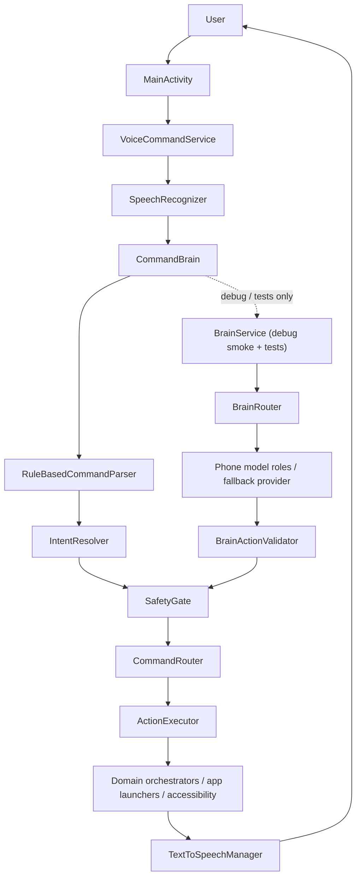
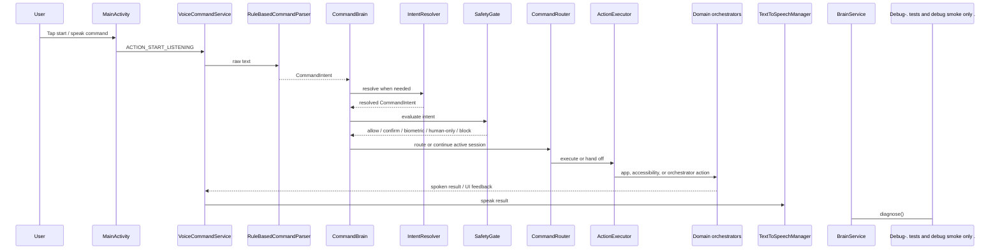
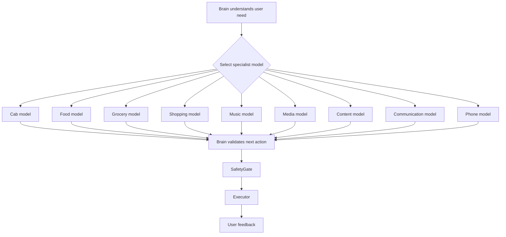
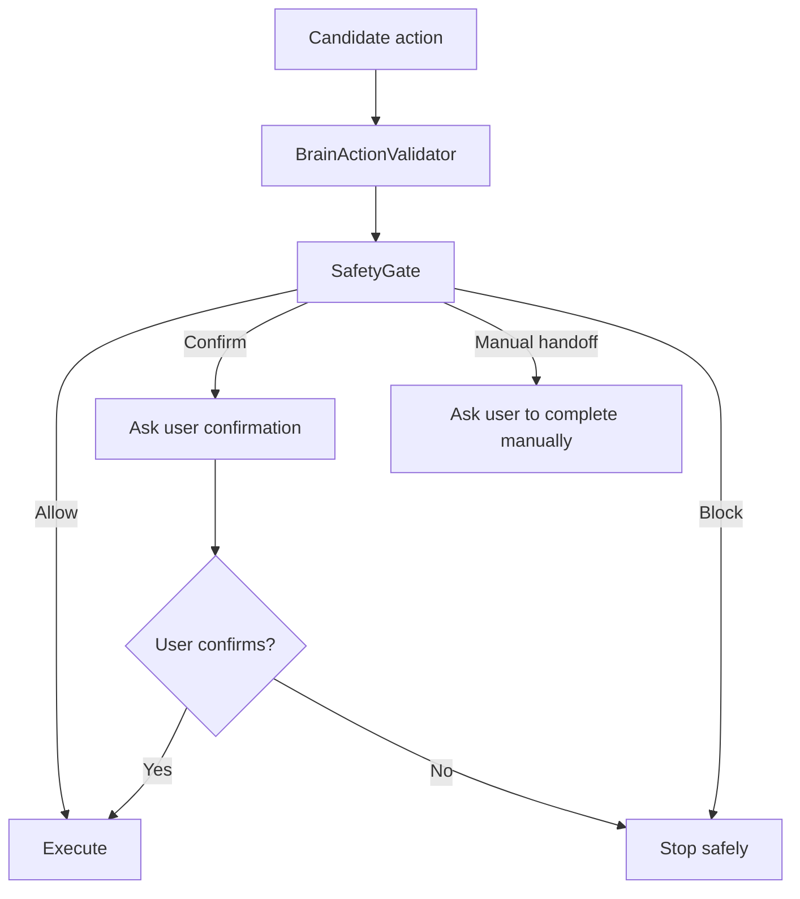
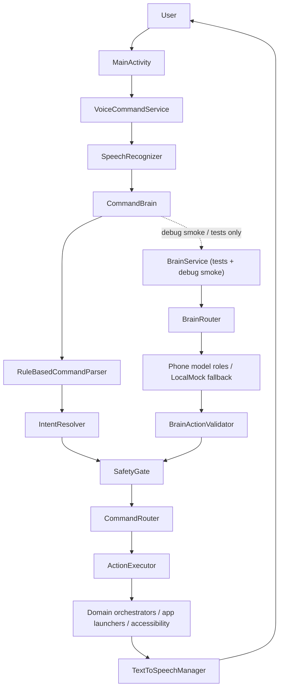
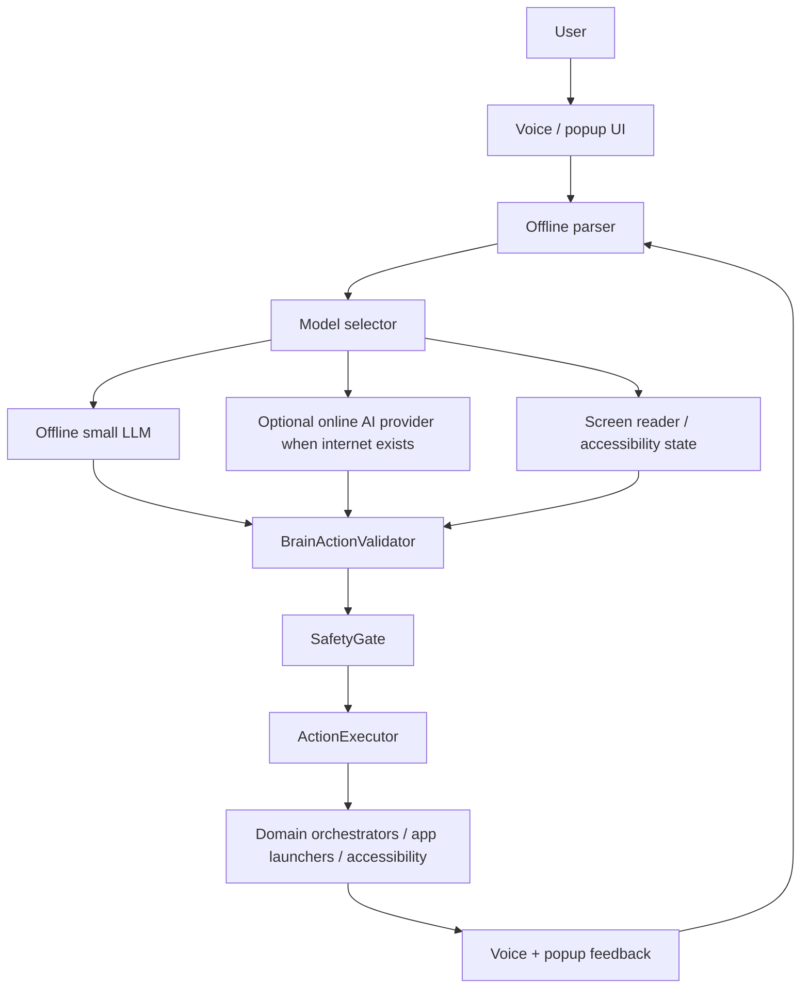

# Nova/Luna Brain A-to-Z Current Report

Date: 2026-06-07

## Scope Note

This report is about the Brain that currently exists in this repository. It focuses on the live Android command loop, the structured BrainService runtime used by tests and debug smoke, the safety chain, accessibility execution, and the current local-first fallback behavior.

Important reality check:

- The live user-command path does **not** currently route through `BrainService`.
- The live path is `VoiceCommandService -> CommandBrain -> RuleBasedCommandParser -> IntentResolver (when needed) -> SafetyGate -> CommandRouter -> ActionExecutor`.
- `BrainService` is still important, but today it is used mainly by tests and the debug smoke receiver to produce and inspect `BrainAction` candidates.
- There is no dedicated popup/overlay controller class in `app/src/main/java/com/nova/luna`; user feedback is delivered through the foreground voice service, notifications, and the app UI.

## 1. Executive Summary

Nova/Luna's Brain is the decision layer that interprets a user command, decides whether the command is safe, routes it to the right action path, and hands the safe result to execution.

In the current codebase the Brain does four different jobs:

1. It normalizes speech/text and recognizes the command type.
2. It routes direct commands to navigation, typing, settings, app-launch, and domain sessions.
3. It blocks or downgrades unsafe actions through `SafetyGate` and `BrainActionValidator`.
4. It hands allowed work to `ActionExecutor`, which then calls the relevant domain orchestrator or Android capability.

The strongest parts of the current Brain are:

- deterministic parsing
- domain-session continuation
- local-first execution
- strong safety boundaries
- extensive unit coverage
- debug smoke support

The biggest gaps are:

- `BrainService` is not the live runtime entry point
- `ScreenUnderstandingModel` is scaffolded and unavailable
- `GemmaBrainModel` and the local on-device model backend are scaffolded
- there is no dedicated popup/overlay controller in the checked-in Android runtime
- the Brain does not yet provide a single universal pending-confirmation queue across all domains

## 2. Current Brain Architecture

### Current actual architecture

### What this means

- `VoiceCommandService` is the live audio entry point.
- `CommandBrain` is the live command brain.
- `RuleBasedCommandParser` does the first-pass command classification.
- `IntentResolver` resolves app names for open-app flows.
- `SafetyGate` is the safety authority before routing to execution.
- `CommandRouter` is the final route from intent to executor.
- `ActionExecutor` dispatches simple device actions and domain orchestration.
- `BrainService` exists as the structured model runtime, but it is currently exercised by tests and `BrainSmokeReceiver`, not by the main live command loop.

## 3. Brain File Map

### 3.1 Requested file names vs actual current equivalents

The prompt referenced a few file names that do not exist in this branch. The current equivalents are:

- `BrainRole.kt` -> `BrainModelRole.kt`
- `BrainResult.kt` -> `BrainModelResult.kt`
- `LocalBrainProvider.kt` -> `LocalMockBrainProvider.kt`
- `OnlineBrainProvider.kt` -> no direct equivalent exists today
- `OfflineBrainProvider.kt` -> `UnavailablePhoneBrainProvider.kt` and the offline-first selection path in `NetworkAwareBrainSelector.kt`

### 3.2 Core live Brain files

| File(s) | Purpose | Key classes / functions | Called by | Calls into | Status |
|---|---|---|---|---|---|
| `app/src/main/java/com/nova/luna/brain/CommandBrain.kt` | Live command entry point | `process`, `shouldRouteMediaConversation` | `VoiceCommandService` | `RuleBasedCommandParser`, `IntentResolver`, `SafetyGate`, `CommandRouter` | Core live runtime |
| `app/src/main/java/com/nova/luna/brain/CommandRouter.kt` | Final route from intent/action to executor | `route(CommandIntent)`, `route(BrainAction)`, session helpers, `toCommandIntent()` | `CommandBrain`, `BrainService` tests | `ActionExecutorGateway` | Core live/runtime bridge |
| `app/src/main/java/com/nova/luna/brain/RuleBasedCommandParser.kt` | First-pass intent parser | `parse`, command classifiers, domain shortcuts | `CommandBrain`, tests | Domain parsers, `AssistantTextNormalizer` | Core live parser |
| `app/src/main/java/com/nova/luna/brain/LocalBrainInterpreter.kt` | Local fallback planning interpreter | `interpret`, cab / grocery / food / message planning helpers | `LocalMockBrainProvider`, tests | Domain parsers, voice response helpers | Core fallback brain |
| `app/src/main/java/com/nova/luna/brain/IntentResolver.kt` | Resolves app launch targets | `resolve` | `CommandBrain` | `AppLauncher` | Core helper |
| `app/src/main/java/com/nova/luna/brain/BrainActionValidator.kt` | Rejects unsafe or malformed `BrainAction` | `isAcceptable`, dangerous final-action checks | `BrainService`, tests | `BrainAction` | Core validator |
| `app/src/main/java/com/nova/luna/brain/BrainActionJsonCodec.kt` | Encodes / decodes structured JSON | `encode`, `decode` | `BrainService`, `ActionJsonModel`, tests | `BrainAction`, `BrainActionType`, `BrainRiskLevel` | Core structured-output utility |
| `app/src/main/java/com/nova/luna/brain/BrainSystemPrompt.kt` | Strict JSON-only prompt contract | `build` | `LocalLlmBrainProvider`, `PhoneGemmaRuntime` | `BrainRequest` | Core prompt scaffold |
| `app/src/main/java/com/nova/luna/brain/BrainService.kt` | Structured model runtime and diagnostics | `process`, `diagnose`, provider / model evaluation helpers | Tests, `BrainSmokeReceiver` | `BrainRouter`, `BrainActionValidator`, `SafetyGate`, providers | Core but not live entry point |
| `app/src/main/java/com/nova/luna/brain/BrainRouter.kt` | Structured role selector | `route`, planning / session prioritization | `BrainService`, tests | `BrainModelRole`, domain parsers | Core structured router |
| `app/src/main/java/com/nova/luna/brain/BrainProviderFactory.kt` | Builds the runtime provider selection | `create`, `createSelection` | `BrainService`, tests | `NetworkAwareBrainSelector`, `LocalMockBrainProvider`, `LocalLlmBrainProvider` | Core runtime selector |
| `app/src/main/java/com/nova/luna/brain/NetworkAwareBrainSelector.kt` | Chooses offline / online-assisted / dev-local mode | `select` | `BrainProviderFactory`, tests | `BrainRuntimeStatus`, providers | Core selector |
| `app/src/main/java/com/nova/luna/brain/InternetPermissionPolicy.kt` | Classifies internet-sensitive input | `classify` | `BrainService`, tests | `AssistantTextNormalizer` | Core policy |

### 3.3 Core model types

| File(s) | Purpose | Key classes / functions | Called by | Calls into | Status |
|---|---|---|---|---|---|
| `app/src/main/java/com/nova/luna/model/ActionType.kt` | High-level action enum used by the live command path | `ActionType` | `RuleBasedCommandParser`, `SafetyGate`, `CommandRouter`, tests | None | Core model enum |
| `app/src/main/java/com/nova/luna/model/IntentType.kt` | Intent classification enum for command parsing | `IntentType` | `RuleBasedCommandParser`, tests | None | Core model enum |
| `app/src/main/java/com/nova/luna/model/CommandIntent.kt` | Parsed command payload passed between parser, safety, and router | `CommandIntent` | `CommandBrain`, `SafetyGate`, `CommandRouter`, tests | `IntentType`, `ActionType` | Core model data type |
| `app/src/main/java/com/nova/luna/model/BrainAction.kt` | Structured action candidate used by `BrainService` | `BrainAction` | `BrainService`, `BrainActionJsonCodec`, `BrainActionValidator`, tests | `BrainActionType`, `BrainRiskLevel`, `BrainModelRole` | Core model data type |
| `app/src/main/java/com/nova/luna/model/BrainActionType.kt` | Candidate action type enum | `BrainActionType` | `BrainAction`, tests | None | Core model enum |
| `app/src/main/java/com/nova/luna/model/BrainRiskLevel.kt` | Candidate risk enum | `BrainRiskLevel` | `BrainAction`, tests | None | Core model enum |
| `app/src/main/java/com/nova/luna/model/BrainModelRole.kt` | Structured role enum | `BrainModelRole` | `BrainRouter`, `BrainService`, tests | None | Core model enum |
| `app/src/main/java/com/nova/luna/model/BrainRouteDecision.kt` | Router result wrapper | `BrainRouteDecision` | `BrainService`, tests | `BrainModelRole` | Core model data type |
| `app/src/main/java/com/nova/luna/model/BrainCapabilityMode.kt` | Runtime capability mode enum | `BrainCapabilityMode` | `BrainRuntimeConfig`, tests | None | Core model enum |
| `app/src/main/java/com/nova/luna/model/BrainRuntimeStatus.kt` | Runtime status enum for provider selection and diagnostics | `BrainRuntimeStatus` | `BrainProviderFactory`, `NetworkAwareBrainSelector`, tests | None | Core model enum |

### 3.4 Phone-model and provider scaffolds

| File(s) | Purpose | Key classes / functions | Called by | Calls into | Status |
|---|---|---|---|---|---|
| `app/src/main/java/com/nova/luna/brain/ActionJsonModel.kt` | Structured planning model for cab, food, grocery, and message planning | `generate`, planning helpers | `BrainService`, tests | `LocalBrainInterpreter`, domain parsers, `BrainActionJsonCodec`, `BrainActionValidator` | Implemented / structured |
| `app/src/main/java/com/nova/luna/brain/LiteCommandModel.kt` | Fast offline command model for simple actions | `generate` | `BrainService`, tests | `RuleBasedCommandParser`, `BrainActionJsonCodec` | Implemented |
| `app/src/main/java/com/nova/luna/brain/ScreenUnderstandingModel.kt` | Read-only screen understanding scaffold | `generate` | `BrainService`, tests | None beyond model result | Planned / unavailable |
| `app/src/main/java/com/nova/luna/brain/GemmaBrainModel.kt` | Phone-local reasoning model wrapper | `generate` | `BrainService`, tests | `PhoneGemmaRuntime`, `BrainActionJsonCodec` | Scaffolded |
| `app/src/main/java/com/nova/luna/brain/PhoneGemmaRuntime.kt` | Phone Gemma readiness and prompt builder scaffold | `readinessStatus`, `generate`, `describeStatus` | `BrainService`, tests | `BrainSystemPrompt`, `GemmaPhoneConfig` | Scaffolded |
| `app/src/main/java/com/nova/luna/brain/PhoneBrainModel.kt` | Phone-model contract | `generate` | `BrainService` | `BrainRequest`, `BrainRouteDecision` | Core interface |
| `app/src/main/java/com/nova/luna/brain/PhoneBrainProvider.kt` | Provider contract with diagnostics | `available`, `analyze`, `diagnose` | `BrainService` | `BrainRequest`, `BrainProviderTrace` | Core interface |
| `app/src/main/java/com/nova/luna/brain/LocalMockBrainProvider.kt` | Guaranteed fallback provider | `analyze`, `diagnose` | `BrainService`, `BrainProviderFactory` | `LocalBrainInterpreter`, `BrainActionJsonCodec` | Core fallback |
| `app/src/main/java/com/nova/luna/brain/LocalLlmBrainProvider.kt` | Dev-only Ollama-compatible local LLM provider | `analyze`, `diagnose`, JSON extraction helpers | `BrainProviderFactory`, tests | `OllamaClient`, `BrainSystemPrompt`, `BrainActionJsonCodec` | Dev-only scaffold |
| `app/src/main/java/com/nova/luna/brain/UnavailablePhoneBrainProvider.kt` | Stub for unavailable phone-local model path | `analyze`, `diagnose` | `BrainService`, `NetworkAwareBrainSelector` | None | Core fallback stub |
| `app/src/main/java/com/nova/luna/brain/OllamaClient.kt` | Local LLM transport interface | `generate` | `LocalLlmBrainProvider` | HTTP client implementation | Core interface |
| `app/src/main/java/com/nova/luna/brain/HttpOllamaClient.kt` | HTTP implementation of Ollama client | `generate`, request body builder | `LocalLlmBrainProvider` | `HttpURLConnection` | Dev-only transport |
| `app/src/main/java/com/nova/luna/brain/BrainRequest.kt` | Structured request wrapper | `BrainRequest` | `BrainService`, tests | None | Core data type |
| `app/src/main/java/com/nova/luna/brain/BrainDiagnostics.kt` | Debug and smoke diagnostics | `BrainDiagnostics`, `BrainProviderTrace`, `BrainProviderDiagnostics` | `BrainService`, `BrainSmokeReceiver`, tests | `BrainAction`, `BrainRouteDecision`, `BrainRuntimeStatus` | Core diagnostics |
| `app/src/main/java/com/nova/luna/brain/BrainRuntimeConfig.kt` | Build-config-backed runtime settings | `BrainRuntimeConfig`, `fromBuildConfig`, `useLocalLlm` | `BrainProviderFactory`, tests | `BuildConfig`, `BrainCapabilityMode` | Core config |
| `app/src/main/java/com/nova/luna/brain/BrainRuntimeSelection.kt` | Provider + runtime status bundle | `BrainRuntimeSelection` | `BrainProviderFactory`, `BrainService` | `BrainRuntimeStatus` | Core config result |
| `app/src/main/java/com/nova/luna/brain/BrainModelResult.kt` | Model result wrapper | `available`, `unavailable`, `hasCandidate` | `BrainService`, tests | `BrainAction`, `BrainModelRole` | Core result type |

### 3.5 Live UI, voice, accessibility, and executor files that the Brain depends on

| File(s) | Purpose | Key classes / functions | Called by | Calls into | Status |
|---|---|---|---|---|---|
| `app/src/main/java/com/nova/luna/MainActivity.kt` | Entry UI, permissions, and voice service launcher | start / stop buttons, voice profile selection | User | `VoiceCommandService`, `PermissionUtils`, `PreferencesManager` | Core UI |
| `app/src/main/java/com/nova/luna/service/VoiceCommandService.kt` | Live speech capture and response loop | `onStartCommand`, `onResults`, `handleRecognizedText`, `speakResult` | `MainActivity`, Android system | `CommandBrain`, `TextToSpeechManager`, history DB | Core live runtime |
| `app/src/main/java/com/nova/luna/tts/TextToSpeechManager.kt` | Local spoken reply output | `prepare`, `speak`, `release` | `VoiceCommandService` | Android TTS | Core voice output |
| `app/src/main/java/com/nova/luna/service/NotificationHelper.kt` | Foreground-service notification and stop action | `ensureChannel`, `buildServiceNotification`, `notifyStatus` | `VoiceCommandService` | `MainActivity`, `VoiceCommandService` | Core live UI support |
| `app/src/main/java/com/nova/luna/service/NovaAccessibilityService.kt` | Accessibility actions and notification snapshots | global actions, click, scroll, type, notification capture | Android accessibility framework, domain flows | `AccessibilityNodeUtils` | Core execution support |
| `app/src/main/java/com/nova/luna/util/AccessibilityNodeUtils.kt` | Recursive node lookup and filtering | `findNodeByTextOrDescription`, `findClickableNode`, `findScrollableNode`, `findEditableNode` | Accessibility services | Android `AccessibilityNodeInfo` | Core utility |
| `app/src/main/java/com/nova/luna/util/AccessibilityReadiness.kt` | Simple accessibility bound-state check | `isBound`, `blockedMessage` | Domain flows | `NovaAccessibilityService` | Core utility |
| `app/src/main/java/com/nova/luna/util/PermissionUtils.kt` | Permission and accessibility readiness checks | mic, notifications, location, usage, accessibility, biometric | `MainActivity`, domain flows | Android permissions and settings APIs | Core utility |
| `app/src/main/java/com/nova/luna/executor/ActionExecutorGateway.kt` | Brain-to-executor contract | `execute`, session helpers, domain handlers | `CommandRouter`, tests | `ActionExecutor` | Core interface |
| `app/src/main/java/com/nova/luna/executor/ActionExecutor.kt` | Final execution dispatcher | `execute`, `handleMediaText`, domain session helpers | `CommandRouter` | app launcher, nav, tap, scroll, type, settings, domain orchestrators | Core executor |
| `app/src/main/java/com/nova/luna/executor/NavExecutor.kt` | Global navigation executor | `goHome`, `goBack`, `openRecents`, `openNotifications` | `ActionExecutor` | `NovaAccessibilityService` | Core executor |

### 3.6 Debug, history, and testing files

| File(s) | Purpose | Key classes / functions | Called by | Calls into | Status |
|---|---|---|---|---|---|
| `app/src/debug/java/com/nova/luna/brain/BrainSmokeReceiver.kt` | Debug smoke harness for `BrainService` | `onReceive`, `runSmoke` | Debug broadcast action | `BrainService`, `BrainSmokePhraseCatalog`, `BrainSmokeLogger` | Debug only |
| `app/src/debug/java/com/nova/luna/brain/BrainSmokePhraseCatalog.kt` | Curated smoke phrases | `phrases` | `BrainSmokeReceiver` | None | Debug only |
| `app/src/debug/java/com/nova/luna/brain/BrainSmokeLogger.kt` | Debug smoke logging helper | `i`, `w`, `e` | Debug smoke receiver | Android log | Debug only |
| `app/src/main/java/com/nova/luna/history/CommandHistoryActivity.kt` | Command history viewer | `loadRecentHistory` | User | Room database, formatter | Supporting UI |
| `app/src/test/java/com/nova/luna/brain/*` | Brain routing, provider, parser, validator, and isolation tests | phase tests, router tests, parser tests, selector tests, smoke assertions | Gradle test suite | Brain runtime | Green |
| `app/src/test/java/com/nova/luna/executor/*` | Executor dispatch tests | media, grocery | Gradle test suite | `ActionExecutor` | Green |
| `app/src/test/java/com/nova/luna/safety/*` | Safety gate tests for food and grocery | direct safety assertions | Gradle test suite | `SafetyGate` | Green |

### 3.7 Domain adapters consulted for Brain routing

These are not the Brain itself, but they are the specialist flows that the Brain routes into:

- `app/src/main/java/com/nova/luna/cab/CabIntentParser.kt`
- `app/src/main/java/com/nova/luna/cab/CabBookingOrchestrator.kt`
- `app/src/main/java/com/nova/luna/cab/CabAccessibilityService.kt`
- `app/src/main/java/com/nova/luna/food/FoodIntentParser.kt`
- `app/src/main/java/com/nova/luna/food/FoodBookingOrchestrator.kt`
- `app/src/main/java/com/nova/luna/food/FoodAccessibilityService.kt`
- `app/src/main/java/com/nova/luna/grocery/GroceryIntentParser.kt`
- `app/src/main/java/com/nova/luna/grocery/GroceryBookingOrchestrator.kt`
- `app/src/main/java/com/nova/luna/grocery/GroceryAccessibilityService.kt`
- `app/src/main/java/com/nova/luna/shopping/ShoppingIntentParser.kt`
- `app/src/main/java/com/nova/luna/shopping/ShoppingOrchestrator.kt`
- `app/src/main/java/com/nova/luna/shopping/ShoppingAccessibilityService.kt`
- `app/src/main/java/com/nova/luna/music/MusicIntentParser.kt`
- `app/src/main/java/com/nova/luna/music/MusicOrchestrator.kt`
- `app/src/main/java/com/nova/luna/music/MusicAccessibilityService.kt`
- `app/src/main/java/com/nova/luna/media/MediaIntentParser.kt`
- `app/src/main/java/com/nova/luna/media/MediaOrchestrator.kt`
- `app/src/main/java/com/nova/luna/media/MediaAccessibilityService.kt`
- `app/src/main/java/com/nova/luna/content/ContentCreationIntentParser.kt`
- `app/src/main/java/com/nova/luna/content/ContentCreationOrchestrator.kt`
- `app/src/main/java/com/nova/luna/communication/CommunicationIntentParser.kt`
- `app/src/main/java/com/nova/luna/communication/CommunicationOrchestrator.kt`
- `app/src/main/java/com/nova/luna/phone/PhoneContactIntentParser.kt`
- `app/src/main/java/com/nova/luna/phone/PhoneContactOrchestrator.kt`

## 4. End-to-End Command Lifecycle

1. The user presses start in `MainActivity`, or the app restarts the foreground voice service.
2. `VoiceCommandService` starts `SpeechRecognizer` in offline-friendly mode and waits for speech.
3. When recognition completes, the raw text is passed to `CommandBrain.process()`.
4. `RuleBasedCommandParser` strips wake words, normalizes text, and classifies the command.
5. `CommandBrain` immediately rejects blocked payment / OTP / login / CAPTCHA / delete commands.
6. `CommandBrain` handles `STOP_SERVICE` first so the service can shut down safely.
7. If the text belongs to an active cab, food, grocery, phone, communication, content, music, shopping, or media session, `CommandBrain` forwards the text to that session handler.
8. If the command is a direct cab / food / grocery / communication / content action, `IntentResolver` may resolve the target app first.
9. `SafetyGate` decides whether the command is allowed, confirmation-required, biometric-required, human-only, or blocked.
10. `CommandRouter` maps the safe command to `ActionExecutor`.
11. `ActionExecutor` performs the simple Android action or hands off to the relevant domain orchestrator.
12. `VoiceCommandService` speaks the result through `TextToSpeechManager` and stores command history.
13. Debug smoke and tests can also call `BrainService.diagnose()` to inspect the structured model runtime and `BrainAction` pipeline.

### Sequence diagram for the current code

## 5. Brain Routing Logic

### 5.1 Live `CommandBrain` priority order

The current live command priority in `CommandBrain` is:

1. Parse the text.
2. Block obvious payment / OTP / login / CAPTCHA / delete commands.
3. Handle `STOP_SERVICE`.
4. Handle direct cab / food / grocery / communication / content actions.
5. Continue active cab, food, phone, communication, content, music, shopping, or media sessions.
6. Route active media control commands when the text is a simple media verb like play/pause/next/stop.
7. Return an unknown failure if nothing matches.
8. Resolve and route the remaining safe command through `SafetyGate` and `CommandRouter`.

### 5.2 `BrainRouter` priority order inside `BrainService`

`BrainRouter` uses a different priority order inside the structured `BrainService` path:

1. Blank input -> mock fallback.
2. Screen query -> `SCREEN_UNDERSTANDING`.
3. Message planning -> `ACTION_JSON`.
4. Active grocery session or grocery planning -> `ACTION_JSON`.
5. Active food session or food planning -> `ACTION_JSON`.
6. Simple commands -> `LITE_COMMAND`.
7. Cab / food / task planning -> `ACTION_JSON`.
8. Generic conversation -> `GEMMA_REASONING`.
9. Unknown requests -> `MOCK_FALLBACK`.

### 5.3 How the special domains are selected

- Cab is detected by `CabIntentParser` and by cab keywords in `BrainRouter` / `LocalBrainInterpreter`.
- Food is detected by `FoodIntentParser`.
- Grocery is detected by `GroceryIntentParser`, with precedence above shopping when the text is clearly a grocery request.
- Shopping is detected after grocery / food / cab parsing, and the parser keeps electronics and shopping requests out of the grocery branch.
- Media is detected by media keywords such as YouTube, Instagram, Netflix, shorts, reels, watchlist, downloads, quality, subtitles, and social actions.
- Music is detected by song, artist, album, playlist, explicit / clean-version, and playback controls.
- Communication is detected by summarize, search, draft reply, draft email, send it, and related message commands.
- Content creation is detected by output-format language such as PPT, image, video, document, spreadsheet, or PDF.
- Phone contact actions are detected by call / create / update contact phrasing and number-from-message phrasing.

### 5.4 How ambiguous commands are handled

- `LocalBrainInterpreter` scores cab, food, and grocery intent when the text is not obvious.
- `BrainRouter` uses the scoring / parser result to select the structured action path.
- `CommandBrain` falls back to `UNKNOWN` if no direct route exists and no active session applies.
- The live command path does not attempt a universal natural-language planner; it is deterministic and defensive by design.

### 5.5 How follow-up commands are handled

Follow-up commands are handled mostly by the domain parsers and orchestrators, not by a single universal Brain queue.

| Domain | Follow-up examples | Where it is handled |
|---|---|---|
| Music | `yes`, `no`, `first one`, `cancel` | `MusicIntentParser`, `MusicOrchestrator` |
| Grocery | `yes`, `no`, `confirm`, `continue`, `cancel` | `GroceryIntentParser`, `GroceryBookingOrchestrator` |
| Food | `confirm`, `yes`, `cancel` | `FoodIntentParser`, `FoodBookingOrchestrator` |
| Cab | `confirm`, `cancel`, `manual pickup`, `change pickup`, `try another app` | `CabIntentParser`, `CabBookingOrchestrator` |
| Phone | `yes`, `no`, `first`, `second`, `cancel` | `PhoneContactIntentParser`, `PhoneContactOrchestrator` |
| Communication | `send it`, `yes send`, `don't send`, `save draft` | `CommunicationIntentParser`, `CommunicationOrchestrator` |
| Media | `yes`, `no`, `confirm`, `cancel` | `MediaIntentParser`, `MediaOrchestrator` |
| Content creation | `yes`, `no`, `approve`, `finalize`, `cancel` | `ContentCreationIntentParser`, `ContentReviewManager`, `ContentCreationOrchestrator` |

## 6. Brain and Model Relationship

The current code has the right separation idea, but only part of it is on the live path.

- The Brain is the central decision layer.
- Specialist models exist in `BrainService`:
  - `GemmaBrainModel`
  - `ActionJsonModel`
  - `LiteCommandModel`
  - `ScreenUnderstandingModel`
  - `LocalMockBrainProvider`
- `BrainRouter` selects which specialist role should handle the request.
- `BrainActionValidator` rejects unsafe model output.
- `SafetyGate` decides whether the action may be executed, must ask for confirmation, must stay manual, or must be blocked.
- `CommandRouter` and `ActionExecutor` do the actual device and domain work.

### What is true today

- The specialist model stack is real and tested.
- The live `CommandBrain` path does not currently invoke `BrainService`.
- `BrainService` is still the structured runtime and debug/test brain, not the production speech loop.

### Future-facing view of the model stack

## 7. Screen Reading and Accessibility Brain

### What the Brain currently reads from the screen

The current accessibility layer can:

- read visible notification summaries
- find clickable nodes by text or content description
- find scrollable nodes
- find editable nodes
- click, scroll forward, scroll backward, and set text
- perform global actions for home, back, recents, and notifications

### What `NovaAccessibilityService` provides

`NovaAccessibilityService` is the live accessibility service singleton. It:

- tracks a bound instance through `instance`
- listens for click, focus, window change, text change, and notification events
- stores recent notification text snapshots
- exposes global actions and node-based action helpers

### What `AccessibilityNodeUtils` provides

`AccessibilityNodeUtils` recursively searches the active accessibility tree and supports:

- text / description matching
- clickable ancestor discovery
- scrollable node discovery
- editable node discovery
- label collection for clickable nodes

### Readiness and permission checks

- `AccessibilityReadiness.isBound()` checks whether the service instance is present.
- `PermissionUtils.hasAccessibilityPermission()` checks whether the accessibility service is enabled.
- `PermissionUtils.hasUsageAccess()` checks usage access.
- `MainActivity` exposes buttons and text status for accessibility, usage access, microphone, and notifications.

### Practical limitations

- If the target app does not expose meaningful nodes, accessibility automation becomes partial.
- `rootInActiveWindow` may be null.
- Provider apps may hide controls behind custom UI, dialogs, or guarded flows.
- There is no universal screen parser in the current live Brain path.

## 8. Safety Brain

`SafetyGate` is the final authority before anything reaches execution.

### Direct `CommandIntent` safety

`SafetyGate.evaluate(CommandIntent)` currently:

- allows `STOP_SERVICE`
- keeps cab / food / grocery / shopping planning safe but manual at final payment / booking steps
- returns biometric-required decisions for sensitive direct commands like call contact and screenshot
- blocks obvious payment / banking / OTP / password / CAPTCHA / delete / final-booking commands
- allows settings and accessibility settings when the phrasing is correct

### `BrainAction` safety

`SafetyGate.evaluate(BrainAction, userConfirmed)` currently:

- rejects `HUMAN_ONLY` and `BLOCKED` candidates
- requires confirmation for `PREPARE` or confirmation-required actions when not already confirmed
- keeps grocery, food, shopping, and cab final actions manual
- leaves `finalActionAllowed` false for irreversible steps

### `BrainActionValidator`

`BrainActionValidator` is a second safety layer before routing:

- it rejects blank intent or blank reply
- it rejects `HUMAN_ONLY` or blocked-risk actions when they claim final actionability
- it rejects dangerous final actions such as payment, OTP, login, booking, delete, and remove-account wording
- it explicitly treats cab, shopping, grocery, and food final actions as dangerous if they try to become irreversible

### Safety flow in one view

### Safety summary by domain

- Cab: compare and prepare is allowed; final booking stays manual.
- Food: compare and prepare is allowed; unsafe items and payment boundaries stay manual.
- Grocery: compare and prepare is allowed; payment, card, OTP, PIN, and final order stay manual.
- Shopping: browse and compare are allowed; sensitive checkout and account steps stay manual.
- Music: playback and app selection are allowed; explicit-content handling asks the user first.
- Media: social / OTT confirmation steps are gated inside the media orchestrator.
- Communication: draft creation is allowed; send must be confirmed.
- Phone: unknown-person call flows ask for confirmation; sensitive routes stay guarded.
- Content creation: draft generation is allowed; share and send are user-confirmed.

## 9. Offline / Local-First Brain Status

### What currently works fully offline

- wake-word stripping and text normalization
- direct command parsing
- navigation, tap, scroll, type, settings, and notifications actions
- domain session continuation
- local voice output through TTS
- debug smoke and unit tests
- `LocalMockBrainProvider` fallback
- `LocalBrainInterpreter` structured fallback planning

### What relies on Android APIs

- `SpeechRecognizer`
- `TextToSpeech`
- accessibility actions
- notification channel and foreground service APIs
- permission and settings screens
- activity launching and package-manager lookups

### What does not require a backend

- the live command loop
- the deterministic parser path
- the executor / accessibility path
- the safety gate
- the debug smoke path

### Online AI status

- There is **no production cloud AI provider** in the current live Brain loop.
- `LocalLlmBrainProvider` is dev-only and uses an Ollama-compatible HTTP client.
- `BrainService` can select a local LLM dev mode when build flags allow it.
- `GemmaBrainModel` and `PhoneGemmaRuntime` are scaffolded, but no real phone-local inference backend is wired yet.

### Honest conclusion

The repo is local-first by design. The live Brain is functional without a backend, and the online / on-device generative paths remain scaffolded or dev-only.

## 10. Brain Memory and Active Sessions

### How active sessions work

- Active sessions are owned by the specialist domain orchestrators, not by a single central Brain memory object.
- `CommandBrain` queries `CommandRouter.hasActive...Session()` helpers to decide whether unknown text should be forwarded to an existing session.
- `ActionExecutor` exposes the `handle...Text()` methods that continue those sessions.

### Where session state lives

- cab -> `CabBookingOrchestrator`
- food -> `FoodBookingOrchestrator`
- grocery -> `GroceryBookingOrchestrator`
- phone -> `PhoneContactOrchestrator`
- communication -> `CommunicationOrchestrator`
- content -> `ContentCreationOrchestrator`
- music -> `MusicOrchestrator`
- shopping -> `ShoppingOrchestrator`
- media -> `MediaOrchestrator`

### Pending confirmation

There is no universal `pendingConfirmationAction` queue in `CommandBrain`.

Instead:

- `CommandResult.awaitingConfirmation` carries confirmation state when a result needs it.
- each domain parser/orchestrator handles its own `yes`, `no`, `confirm`, `cancel`, `first one`, or `continue` semantics.
- `SafetyGate` and domain result objects decide whether a follow-up must be manual or can continue.

### User context and preferences

Current context is lightweight:

- voice profile selection is stored in preferences
- command history is saved locally
- domain sessions carry their own request state

What is still missing:

- a universal cross-domain memory store
- long-term preference learning in the Brain layer
- a single shared confirmation ledger across all domains

## 11. Brain Diagnostics and Testing

### Diagnostics classes

- `BrainDiagnostics`
- `BrainProviderTrace`
- `BrainProviderDiagnostics`
- `BrainRuntimeStatus`
- `BrainRuntimeSelection`
- `BrainModelResult`
- `BrainRouteDecision`

### What diagnostics tell us

The debug and test diagnostics can report:

- selected provider
- selected role
- raw provider output
- extracted BrainAction JSON
- parsed `BrainAction`
- whether validation passed
- whether fallback was used
- final provider
- final safety decision
- runtime capability mode and readiness
- internet permission classification

### Test coverage table

| Test file(s) | What it validates | Status |
|---|---|---|
| `app/src/test/java/com/nova/luna/brain/BrainServicePhase1Test.kt` | cab / grocery / prepare-message structured output and JSON round trip | Green |
| `app/src/test/java/com/nova/luna/brain/BrainServicePhase2Test.kt` | JSON decoding, fallback, and dangerous-output rejection | Green |
| `app/src/test/java/com/nova/luna/brain/BrainServicePhase3Test.kt` | diagnostics, fallback, and missing-field rejection | Green |
| `app/src/test/java/com/nova/luna/brain/BrainServicePhase4Test.kt` | offline / online-assisted capability modes and blocked actions | Green |
| `app/src/test/java/com/nova/luna/brain/BrainServicePhase5Test.kt` | structured actions, router handoff, grocery parsing, and Flutter isolation guard | Green |
| `app/src/test/java/com/nova/luna/brain/BrainServicePhase6Test.kt` | Gemma readiness, model loading, fallback behavior, and validator protection | Green |
| `app/src/test/java/com/nova/luna/brain/BrainRouterPhase5Test.kt` | router priority for lite command, action JSON, screen understanding, fallback | Green |
| `app/src/test/java/com/nova/luna/brain/BrainRouterGroceryTest.kt` | grocery routing and active grocery continuity | Green |
| `app/src/test/java/com/nova/luna/brain/RuleBasedCommandParserCabBookingTest.kt` | cab parsing and pickup / drop extraction | Green |
| `app/src/test/java/com/nova/luna/brain/RuleBasedCommandParserFoodBookingTest.kt` | food vs grocery boundary and provider extraction | Green |
| `app/src/test/java/com/nova/luna/brain/RuleBasedCommandParserGroceryBookingTest.kt` | grocery parsing, compare mode, and non-grocery exclusions | Green |
| `app/src/test/java/com/nova/luna/brain/RuleBasedCommandParserMusicShoppingTest.kt` | music / media / shopping branch separation | Green |
| `app/src/test/java/com/nova/luna/brain/LocalLlmBrainProviderTest.kt` | dev-local LLM provider parsing and JSON cleanup | Green |
| `app/src/test/java/com/nova/luna/brain/NetworkAwareBrainSelectorTest.kt` | offline-only and fallback selection | Green |
| `app/src/test/java/com/nova/luna/brain/InternetPermissionPolicyTest.kt` | internet gating and blocked sensitive phrases | Green |
| `app/src/test/java/com/nova/luna/brain/BrainActionValidatorTest.kt` | dangerous final-action rejection | Green |
| `app/src/test/java/com/nova/luna/brain/CommandRouterSafetyTest.kt` | router execution path for safe and sensitive intents | Green |
| `app/src/test/java/com/nova/luna/brain/CommandRouterDomainRoutingTest.kt` | domain conversation handoff helpers | Green |
| `app/src/test/java/com/nova/luna/brain/CommandBrainStopListeningTest.kt` | stop-listening parsing and shutdown path | Green |
| `app/src/test/java/com/nova/luna/brain/CommandBrainOpenAppTest.kt` | open-app handling | Green |
| `app/src/test/java/com/nova/luna/brain/CommandBrainNavigationTest.kt` | home/back/recents/navigation behavior | Green |
| `app/src/test/java/com/nova/luna/brain/CommandBrainScrollTest.kt` | scroll control routing | Green |
| `app/src/test/java/com/nova/luna/brain/CommandBrainTapClickTest.kt` | tap / click routing | Green |
| `app/src/test/java/com/nova/luna/brain/CommandBrainTypeTextTest.kt` | typing / text entry routing | Green |
| `app/src/test/java/com/nova/luna/brain/CommandBrainSettingsTest.kt` | settings and accessibility settings routing | Green |
| `app/src/test/java/com/nova/luna/brain/CommandBrainUsageAccessSettingsTest.kt` | usage access settings routing | Green |
| `app/src/test/java/com/nova/luna/brain/CommandBrainNotificationsTest.kt` | notification action routing | Green |
| `app/src/test/java/com/nova/luna/brain/CommandBrainRecentsTest.kt` | recents action routing | Green |
| `app/src/test/java/com/nova/luna/brain/CommandBrainGoHomeTest.kt` | go-home routing | Green |
| `app/src/test/java/com/nova/luna/brain/CommandBrainGoBackTest.kt` | go-back routing | Green |
| `app/src/test/java/com/nova/luna/brain/CommandBrainFoodOrderTest.kt` | food command routing through the live brain | Green |
| `app/src/test/java/com/nova/luna/brain/FlutterAppIsolationTest.kt` | Flutter is not wired into the Android module graph | Green |
| `app/src/test/java/com/nova/luna/executor/ActionExecutorMediaTest.kt` | media executor path | Green |
| `app/src/test/java/com/nova/luna/executor/ActionExecutorGroceryTest.kt` | grocery executor path | Green |
| `app/src/test/java/com/nova/luna/safety/FoodSafetyGateTest.kt` | unsafe food blocking | Green |
| `app/src/test/java/com/nova/luna/safety/GrocerySafetyGateTest.kt` | grocery payment / final-order safety | Green |
| `app/src/test/java/com/nova/luna/safety/ShoppingSafetyGateTest.kt` | shopping confirmation and secret handling | Green |

### Current validation status

The codebase previously passed:

- `.\gradlew.bat :app:compileDebugKotlin --no-daemon --console=plain`
- `.\gradlew.bat :app:testDebugUnitTest --no-daemon --console=plain`
- `.\gradlew.bat :app:assembleDebug --no-daemon --console=plain`

For this report-only task, the minimum verification is `git diff --check`.

## 12. Current Brain Strengths

- Local-first by default
- Deterministic parser behavior
- Strong safety gate and validator separation
- Active domain-session continuation
- Direct Android capability integration
- Accessibility-aware execution for supported screens
- Debug smoke coverage for model diagnostics
- Strong unit test coverage
- Guaranteed fallback provider behavior
- No production backend dependency

## 13. Current Brain Limitations / Gaps

- `BrainService` is not the live runtime entry point.
- `ScreenUnderstandingModel` is not wired yet.
- `GemmaBrainModel` and `PhoneGemmaRuntime` are scaffolded, not backed by a real on-device model.
- `LocalLlmBrainProvider` is dev-only and requires explicit config.
- There is no separate `OnlineBrainProvider` implementation in this branch.
- There is no universal Brain-level pending confirmation queue shared across all domains.
- The current UI is an activity plus foreground service, not a dedicated popup/overlay controller.
- Accessibility automation is only as good as the target app's exposed nodes.
- Some provider apps still require manual user action at the last step by design.

## 14. Recommended Future Brain Roadmap

| Phase | Goal | Files likely affected | Tests needed | Risk |
|---|---|---|---|---|
| Phase 1 | Stabilize the deterministic live Brain and keep parser / safety behavior consistent | `CommandBrain.kt`, `RuleBasedCommandParser.kt`, `SafetyGate.kt`, `CommandRouter.kt`, tests | parser, safety, and session tests | Low |
| Phase 2 | Improve screen-reader state tracking and accessibility recovery | `NovaAccessibilityService.kt`, `AccessibilityNodeUtils.kt`, `AccessibilityReadiness.kt`, domain accessibility services | UI-tree and node-discovery tests | Medium |
| Phase 3 | Add a real local on-device LLM planner | `BrainService.kt`, `BrainRouter.kt`, `GemmaBrainModel.kt`, `PhoneGemmaRuntime.kt`, `BrainProviderFactory.kt` | readiness, fallback, and JSON-safety tests | High |
| Phase 4 | Add an optional online provider when internet is available | New provider files, `BrainProviderFactory.kt`, `NetworkAwareBrainSelector.kt` | provider-selection and offline fallback tests | High |
| Phase 5 | Build a hybrid brain selector that chooses offline parser, local model, or online provider by policy | `BrainRuntimeConfig.kt`, `BrainRuntimeStatus.kt`, `NetworkAwareBrainSelector.kt` | selection matrix tests | Medium |
| Phase 6 | Add local memory and preference learning | `PreferencesManager`, history / memory storage, potentially new brain memory files | persistence and recall tests | Medium |
| Phase 7 | Add a more universal app-action planner | `ActionExecutor.kt`, domain orchestrators, parser heuristics | integration tests per domain | High |
| Phase 8 | Add quality scoring, self-checks, and recovery behavior | `BrainDiagnostics.kt`, smoke harness, fallback heuristics | smoke and regression tests | Medium |

## 15. Brain Mermaid: Current Actual Flow

## 16. Brain Mermaid: Future Ideal Flow

This future flow is intentionally labeled FUTURE. It is not the current production path.

## 17. Final Status

- Branch: `main`
- Files inspected: Brain runtime, provider, safety, executor, UI / accessibility, model, debug smoke, and test files listed above
- Report file created: `docs/NOVA_LUNA_BRAIN_A_TO_Z_CURRENT_REPORT.md`
- Code changed: no production logic changed for this task
- Validation run: `git diff --check` is required for this report-only task
- Current Brain status: PARTIAL overall, with a strong live deterministic command loop and a scaffolded structured model layer
- Future Brain status: clear path to a hybrid offline / local-model / optional-online planner
- Remaining uncertainties: no live `BrainService` integration in `CommandBrain`, no dedicated popup overlay class, and no real on-device model backend yet
- Safe to push: yes, once the report file is reviewed and committed if desired
