# Nova/Luna Mermaid Flowcharts

This file mirrors the uploaded Mermaid PDF specification for the active Nova/Luna flows.

## Core Runtime

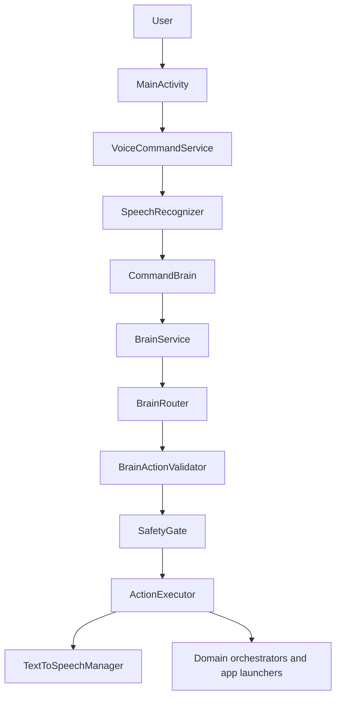

## Safety Gate

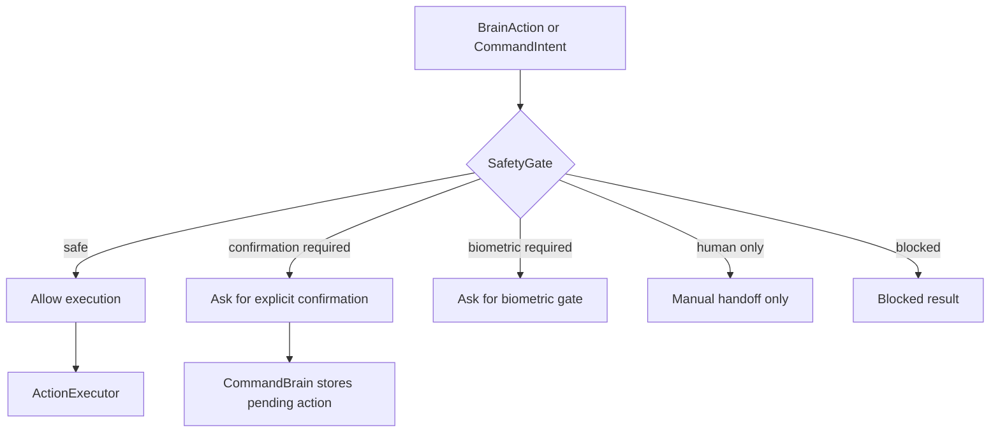

## Music

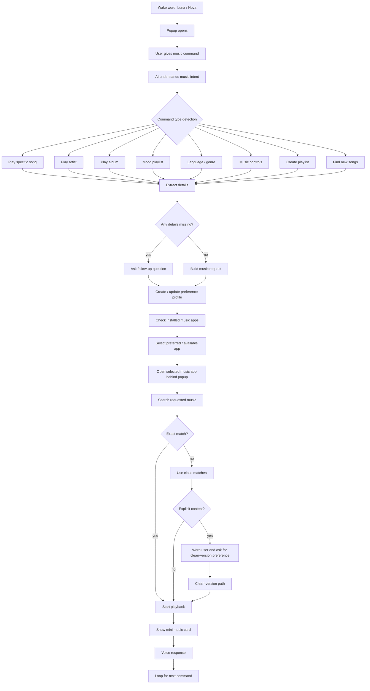

## Shopping

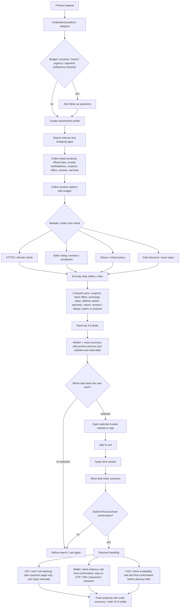

## Media

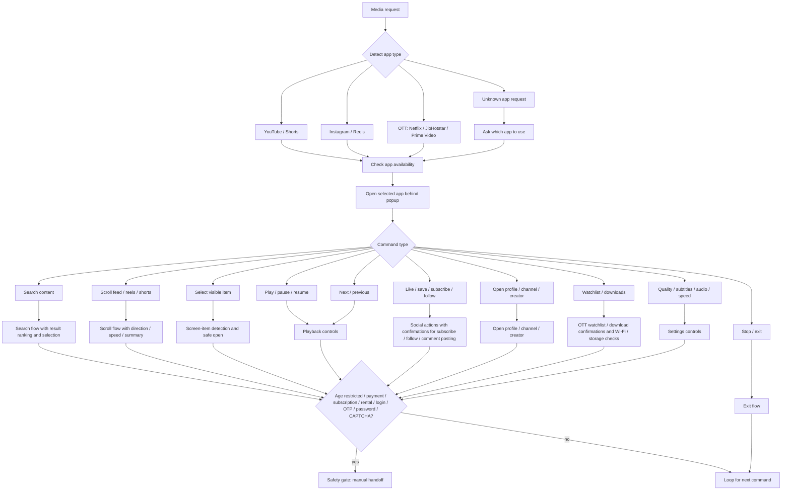

## Grocery

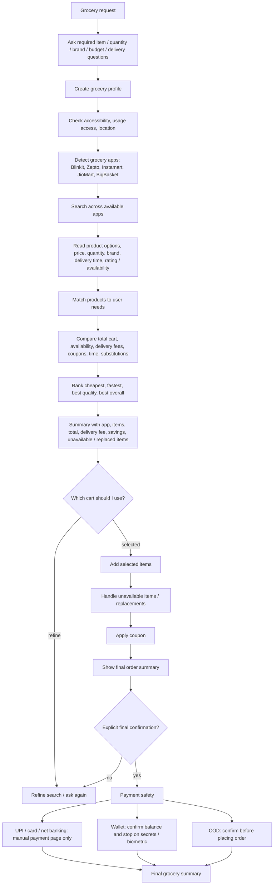

## Content Creation

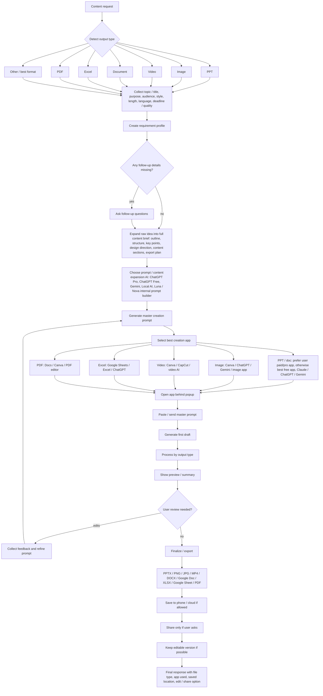

## Communication

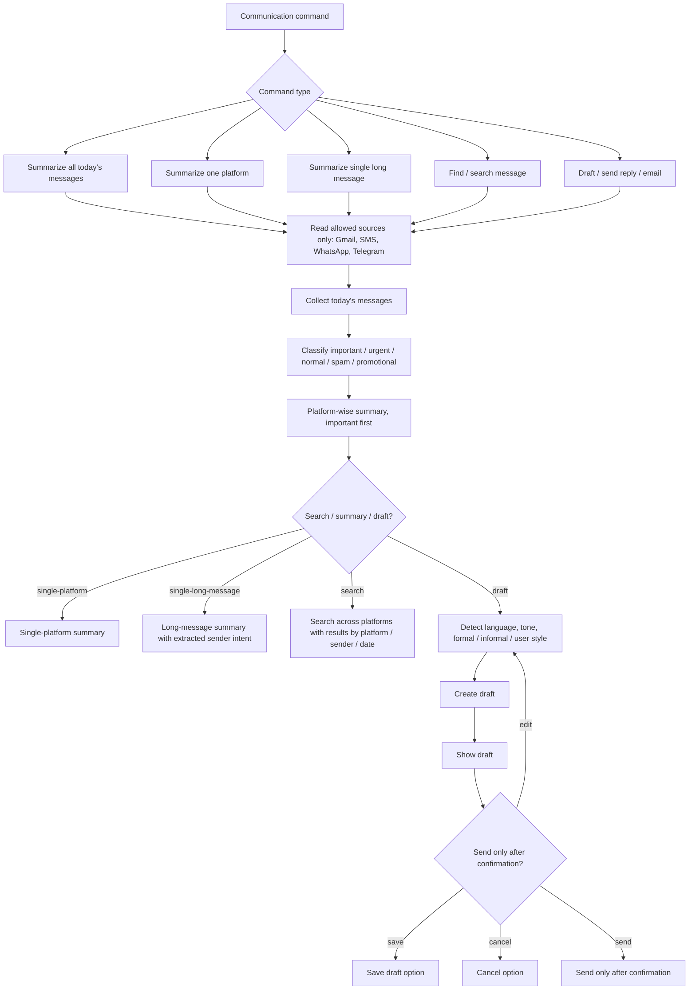

## Phone

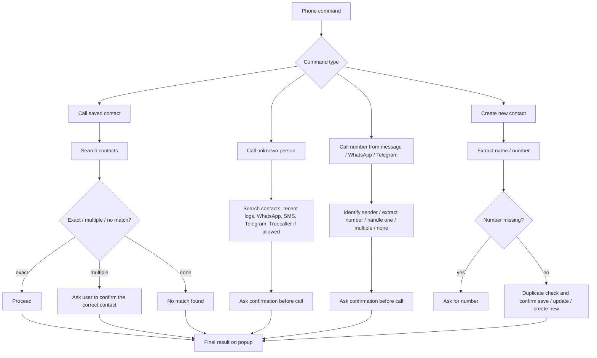

## Food

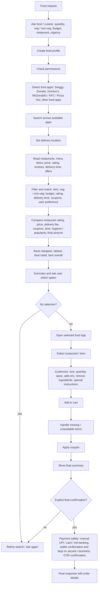

## Cab

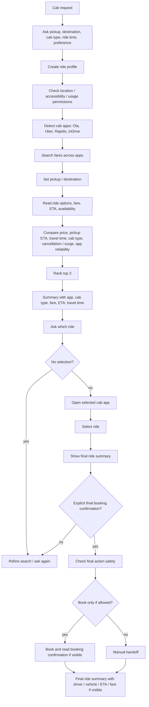
