# Nova/Luna Full Architecture and Workflow Report

## 1. Executive Summary

Nova/Luna is a phone-first Android assistant project that is designed to run local-first, offline-first, and zero-backend-cost by default. In this repository snapshot, the active implementation is the native Android app module plus a Wear OS scaffold and a shared constants module. There is no `flutter_app/` directory in this branch, so Flutter is not part of the current checked-in implementation.

Nova is the male assistant voice profile. Luna is the female assistant voice profile. The user can choose which profile to use, and the current code stores that choice locally while using Android TextToSpeech pitch and speech-rate tuning to approximate the persona.

The repo already contains a working voice loop, command parsing, safety gating, provider-aware cab/food/grocery orchestration, local persistence, command history, and debug smoke receivers. The biggest current gaps are model readiness, provider UI reliability, and a few permission-bound paths on real phones.

Current state in plain terms:

- Core speech input, command routing, TTS, and safety are implemented.
- Cab, food, and grocery flows exist and are locally stateful.
- Grocery is the strongest live flow on the current phone.
- Cab is partial because current-location pickup is blocked by missing location permission and manual pickup still depends on provider foreground access.
- Food is partial because installed apps are detected, but search/cart controls are not reliably accessible on this phone.
- The on-device Gemma path is scaffolded but not wired to a real backend/model yet, so `LocalMockBrainProvider` remains the default fallback.

## 2. Product Vision

Nova/Luna is aiming at a voice-first replacement for traditional phone interaction. The product vision in the repo and docs is:

- Voice-first phone control that can launch apps, navigate screens, enter text, inspect notifications, and drive safe user-approved tasks.
- Luna as the female assistant persona and Nova as the male assistant persona.
- A user-selectable persona and voice profile, with local TTS tuning for pitch and rate.
- A lightweight assistant popup or overlay concept for fast access to the assistant.
- Background task assistance for phone actions, while still keeping the user visible and in control of sensitive steps.
- A long-term replacement for touch-centric assistant usage.
- Future wearable support as a companion layer.
- Future OEM / mobile-manufacturer licensing or built-in assistant distribution.

Current implementation status:

- Voice-first control: implemented in the phone app.
- Persona selection: partially implemented through voice profile selection.
- Popup/overlay concept: planned, not implemented.
- Wearable companion: scaffolded.
- OEM licensing model: vision only.

## 3. Current Repository Structure

Repository snapshot:

```text
.
|-- app/
|   |-- src/main/java/com/nova/luna/...
|   |-- src/main/res/...
|   |-- src/main/AndroidManifest.xml
|   |-- src/debug/java/com/nova/luna/...
|   `-- src/test/java/com/nova/luna/...
|-- wear/
|   |-- src/main/java/com/nova/luna/wear/...
|   |-- src/main/res/...
|   `-- src/main/AndroidManifest.xml
|-- shared/
|   `-- src/main/java/com/nova/luna/shared/...
|-- docs/
|-- gradle/
|-- build.gradle
|-- settings.gradle
|-- gradlew
|-- gradlew.bat
|-- README.md
|-- README_AGENT.md
|-- AGENTS.md
|-- *.patch legacy artifacts
`-- flutter_app/ not present in this snapshot
```

Major directories:

- `app/`: active phone app module, including voice service, accessibility service, brain/safety/executor layers, cab/food/grocery flows, history UI, and tests.
- `wear/`: Wear OS companion scaffold with mic relay and simple command forwarding.
- `shared/`: shared channel constants for phone/watch messaging.
- `docs/`: architecture, process, readiness, safety, validation, and roadmap notes.
- `gradle/`, `build.gradle`, `settings.gradle`: build configuration and module wiring.
- `*.patch` files at repo root: legacy / historical artifacts, not core runtime.

Important repo-level note:

- `flutter_app/` is not present here, so this branch should be treated as native Android plus Wear OS scaffold, not a mixed Flutter-native runtime.

## 4. Core Runtime Architecture

At runtime the assistant works like this:

1. The user starts listening from `MainActivity`.
2. `VoiceCommandService` runs in the foreground and captures speech through `SpeechRecognizer`.
3. Raw text goes into `CommandBrain`.
4. `CommandBrain` handles stop/cancel, active-session follow-ups, and pending confirmations first.
5. `BrainService` builds a structured brain candidate.
6. `BrainRouter` selects a phone model role.
7. The selected model emits a candidate `BrainAction`.
8. `BrainActionValidator` rejects dangerous or malformed output.
9. `CommandRouter` sends the candidate through `SafetyGate`.
10. `ActionExecutor` performs the safe action or hands the request to a domain orchestrator.
11. `TextToSpeechManager` speaks the result.
12. Local Room and DataStore persist history and preferences.

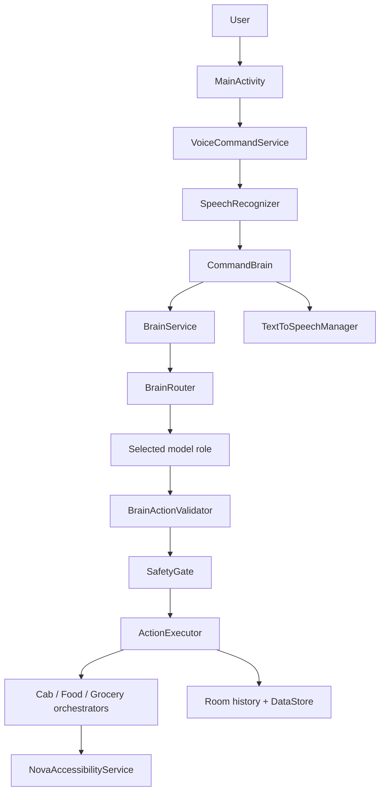

## 5. Brain Architecture

The brain stack is intentionally candidate-only. Models and providers may suggest actions, but they cannot execute device actions directly. Execution only happens after validation and safety gating.

### Core orchestration files

| File | Responsibility |
|---|---|
| `app/src/main/java/com/nova/luna/brain/BrainService.kt` | Owns provider selection, route evaluation, validation fallback, diagnostics, and policy checks. |
| `app/src/main/java/com/nova/luna/brain/BrainRouter.kt` | Chooses the phone-model role: Gemma reasoning, action JSON, lite command, screen understanding, or mock fallback. |
| `app/src/main/java/com/nova/luna/brain/BrainDiagnostics.kt` | Captures provider output, parsed actions, runtime status, and safety outcome for debug smoke and inspection. |
| `app/src/main/java/com/nova/luna/brain/BrainActionValidator.kt` | Rejects invalid or dangerous model output before routing. |
| `app/src/main/java/com/nova/luna/brain/BrainActionJsonCodec.kt` | Encodes and decodes strict `BrainAction` JSON. |
| `app/src/main/java/com/nova/luna/brain/BrainSystemPrompt.kt` | Defines the strict JSON-only prompt contract for the local brain. |
| `app/src/main/java/com/nova/luna/brain/BrainProviderFactory.kt` | Selects the runtime provider path from build config and availability. |
| `app/src/main/java/com/nova/luna/brain/NetworkAwareBrainSelector.kt` | Chooses offline-only, online-assisted, or local-LLM-dev runtime selection. |
| `app/src/main/java/com/nova/luna/brain/InternetPermissionPolicy.kt` | Classifies commands as local-only, info-lookup-only, or sensitive/blocked. |
| `app/src/main/java/com/nova/luna/brain/CommandBrain.kt` | User-facing command entry point that handles wake-word stripping, stop/cancel, confirmations, and active sessions. |
| `app/src/main/java/com/nova/luna/brain/CommandRouter.kt` | Final routing layer between `BrainAction` / `CommandIntent` and the executor. |

### Model and provider files

| File | Responsibility |
|---|---|
| `app/src/main/java/com/nova/luna/model/BrainAction.kt` | Structured candidate object emitted by the brain. |
| `app/src/main/java/com/nova/luna/model/BrainActionType.kt` | Candidate action class: none, read-only, prepare, external, human-only. |
| `app/src/main/java/com/nova/luna/model/BrainModelRole.kt` | Role selection enum for routing. |
| `app/src/main/java/com/nova/luna/model/BrainRouteDecision.kt` | Route result with required context and safety notes. |
| `app/src/main/java/com/nova/luna/model/BrainRuntimeStatus.kt` | Runtime readiness snapshot used by diagnostics. |
| `app/src/main/java/com/nova/luna/model/BrainRiskLevel.kt` | Candidate risk enum. |
| `app/src/main/java/com/nova/luna/model/BrainCapabilityMode.kt` | Runtime capability mode: offline-only, online-assisted, local-LLM-dev. |
| `app/src/main/java/com/nova/luna/brain/PhoneBrainModel.kt` | Interface for role-based phone models. |
| `app/src/main/java/com/nova/luna/brain/PhoneBrainProvider.kt` | Provider interface for phone-model execution. |
| `app/src/main/java/com/nova/luna/brain/GemmaBrainModel.kt` | Gemma-facing phone model wrapper. |
| `app/src/main/java/com/nova/luna/brain/PhoneGemmaRuntime.kt` | Gemma runtime readiness and prompt building scaffold. |
| `app/src/main/java/com/nova/luna/brain/GemmaPhoneConfig.kt` | Build-config-backed Gemma runtime config. |
| `app/src/main/java/com/nova/luna/brain/ActionJsonModel.kt` | Local structured planner for cab, food, grocery, and task planning. |
| `app/src/main/java/com/nova/luna/brain/LiteCommandModel.kt` | Fast local command role for stop, home, back, scroll, tap, settings, and related actions. |
| `app/src/main/java/com/nova/luna/brain/ScreenUnderstandingModel.kt` | Future read-only screen analysis role, not wired yet. |
| `app/src/main/java/com/nova/luna/brain/LocalMockBrainProvider.kt` | Guaranteed fallback provider. |
| `app/src/main/java/com/nova/luna/brain/LocalLlmBrainProvider.kt` | Dev-only Ollama-compatible local LLM path. |
| `app/src/main/java/com/nova/luna/brain/UnavailablePhoneBrainProvider.kt` | Stub used when no phone-local model exists yet. |
| `app/src/main/java/com/nova/luna/brain/OllamaClient.kt` | Local LLM transport interface. |
| `app/src/main/java/com/nova/luna/brain/HttpOllamaClient.kt` | HTTP implementation for the dev-only Ollama path. |
| `app/src/main/java/com/nova/luna/brain/LocalBrainInterpreter.kt` | Rule-driven local interpreter for the mock fallback path. |
| `app/src/main/java/com/nova/luna/brain/RuleBasedCommandParser.kt` | Direct parser for commands, navigation, open-app, and sensitive actions. |
| `app/src/main/java/com/nova/luna/brain/IntentResolver.kt` | Resolves app names to launchable packages. |

Candidate-only rule:

- Models produce `BrainAction` candidates or structured JSON, not direct executor calls.
- `BrainActionValidator` and `SafetyGate` are separate guards.
- `BrainSystemPrompt` explicitly says the brain is not autonomous and must output JSON only.
- `ActionJsonModel`, `LiteCommandModel`, and `GemmaBrainModel` all return candidates that must still be validated.

Why models cannot execute actions directly:

- It preserves a hard separation between interpretation and execution.
- It lets `SafetyGate` remain the final authority.
- It prevents a model from bypassing confirmation, biometric, or human-only boundaries.

## 6. Command Understanding and Routing

Command understanding is split across three layers:

- `AssistantTextNormalizer.stripWakeWords()` removes `Luna` or `Nova` prefixes.
- `RuleBasedCommandParser` handles direct commands and structured intent extraction.
- `BrainRouter` decides whether the input should go through simple command handling, structured planning, or conversation reasoning.

Wake-word handling:

- `AssistantTextNormalizer` strips `Luna` / `Nova` and a small `hey` prefix.
- `CommandBrain` strips wake words before most processing.
- This means user commands can be spoken as `Luna go home`, `Nova open WhatsApp`, or just `go home`.

Intent separation:

- Cab requests are routed through `CabIntentParser` and the cab orchestration stack.
- Food requests are routed through `FoodIntentParser` and the food orchestration stack.
- Grocery requests are routed through `GroceryIntentParser` and the grocery orchestration stack.
- Simple device commands go through the lite command path.
- Read-only or general conversational requests can go through Gemma reasoning when enabled.

How natural language stays flexible:

- `RuleBasedCommandParser` accepts many aliases for navigation and app launch.
- Cab, food, and grocery parsers handle provider names, coupons, quantities, brands, ride types, and follow-up replies.
- `IntentResolver` can resolve app labels to installed packages before launching.

## 7. Safety Architecture

`SafetyGate` is the single authority before execution. It is used both for `CommandIntent` and for `BrainAction`.

Safety categories in the code:

- Safe
- Confirmation required
- Human only
- Blocked
- Sensitive / biometric-gated

Sensitive boundaries enforced by code:

- Payment
- OTP
- CAPTCHA
- Login / sign-in
- Password entry
- Banking / UPI / transfer flows
- Final booking / final order / checkout / purchase confirmation
- Delete / erase / remove account actions

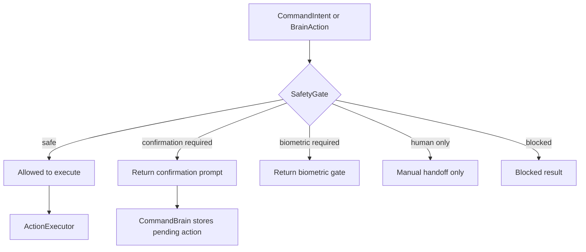

Important implementation details:

- `SafetyGate.evaluate(CommandIntent)` blocks direct payment, banking, password, OTP, CAPTCHA, and checkout-style commands.
- `SafetyGate.evaluate(BrainAction)` blocks or downgrades dangerous final actions even if a model suggests them.
- `CommandRouter` converts the decision into `CommandResult.blocked`, `confirmationRequired`, or `biometricRequired`.
- `ActionExecutor` has its own guard against dangerous final commands as a second line of defense.

Negative safety tests exist for:

- pay now
- enter OTP
- complete payment
- bypass login
- solve captcha

## 8. Action Execution Architecture

The execution layer is split into a gateway plus focused executors and domain orchestrators.

### Execution entry points

| File | Responsibility |
|---|---|
| `app/src/main/java/com/nova/luna/executor/ActionExecutorGateway.kt` | Interface for execution and session-handoff operations. |
| `app/src/main/java/com/nova/luna/executor/ActionExecutor.kt` | Concrete executor that routes safe actions to app launch, navigation, tapping, typing, settings, notifications, cab, food, and grocery. |
| `app/src/main/java/com/nova/luna/executor/AppLauncher.kt` | Fuzzy app launch by installed app label / package. |
| `app/src/main/java/com/nova/luna/executor/NavExecutor.kt` | Home, back, recents, notifications. |
| `app/src/main/java/com/nova/luna/executor/TapExecutor.kt` | Tap-by-text/description. |
| `app/src/main/java/com/nova/luna/executor/ScrollExecutor.kt` | Scroll forward/backward. |
| `app/src/main/java/com/nova/luna/executor/TypeExecutor.kt` | Type into the focused node. |
| `app/src/main/java/com/nova/luna/executor/SettingsExecutor.kt` | Open Android settings, accessibility settings, and usage access settings. |
| `app/src/main/java/com/nova/luna/executor/NotificationReader.kt` | Read latest notification summary when permissions are present. |

### Domain handoffs

| File | Responsibility |
|---|---|
| `app/src/main/java/com/nova/luna/cab/CabBookingOrchestrator.kt` | Cab session state machine. |
| `app/src/main/java/com/nova/luna/food/FoodBookingOrchestrator.kt` | Food session state machine. |
| `app/src/main/java/com/nova/luna/grocery/GroceryBookingOrchestrator.kt` | Grocery session state machine. |

Manual handoff behavior:

- If a provider screen becomes inaccessible, the orchestrator returns a manual-action result.
- If a final booking or final order would happen, the flow stops and asks for explicit user confirmation.
- If payment / OTP / login / CAPTCHA appears, the flow stops and returns manual-action or blocked status.

## 9. Accessibility Architecture

The app uses accessibility as a controlled execution surface, not as silent autonomy.

### Main service

- `app/src/main/java/com/nova/luna/service/NovaAccessibilityService.kt`
- Declared in `app/src/main/AndroidManifest.xml`
- Configured by `app/src/main/res/xml/accessibility_service_config.xml`

Supported global actions:

- Go home
- Go back
- Open recents
- Open notifications

Supported node actions:

- Click by text or description
- Scroll forward / backward
- Type into the focused or editable node

### Provider-specific screen helpers

| File | Role |
|---|---|
| `app/src/main/java/com/nova/luna/cab/CabAccessibilityService.kt` | Cab screen inspection, fare capture, destination field attempts, and manual-action detection. |
| `app/src/main/java/com/nova/luna/food/FoodAccessibilityService.kt` | Food search/cart inspection, quote capture, coupon attempts, and manual-action detection. |
| `app/src/main/java/com/nova/luna/grocery/GroceryAccessibilityService.kt` | Grocery search/cart inspection, coupon handling, summary capture, and manual-action detection. |

Permissions and readiness:

- Accessibility permission is required for all deep UI automation.
- `AccessibilityReadiness.isReady()` checks both the permission and the service binding.
- If accessibility is not bound, the code fails closed with `BLOCKED_BY_ACCESSIBILITY_NOT_READY`.

Current device smoke status:

- Latest manual phone test results say the accessibility service was enabled and bound on the test phone during the deep rerun.
- Earlier and future runs intentionally fail closed when accessibility is missing.

Known limitations:

- Provider UI changes can break label discovery.
- `FLAG_SECURE` content cannot be bypassed.
- Some apps hide search/cart controls from accessibility.
- Gesture injection is disabled in the accessibility service config.

## 10. Cab Booking Flow

Current code path:

- `RuleBasedCommandParser` and `CabIntentParser` recognize cab booking, current location, ride type, provider choice, cheapest/first-choice, and cancel/follow-up phrases.
- `CabBookingOrchestrator` runs the state machine.
- `CabProviderRegistry` detects installed cab apps.
- `CabDeepLinkBuilder` opens provider apps or fallback intents.
- `CabAccessibilityService` fills fields, collects fares, and detects manual-action screens.
- `CabFareComparator` sorts fares from lowest to highest.

Supported providers in code:

- Uber
- Ola
- Rapido
- inDrive

Current phone status from the latest manual test doc:

- Installed on the phone: Ola, Rapido
- Missing on the phone: Uber, inDrive

Flow states:

- IDLE
- PARSING_REQUEST
- NEED_PICKUP
- NEED_DROP
- NEED_RIDE_TYPE
- CHECKING_PROVIDERS
- OPENING_PROVIDER
- FILLING_TRIP
- COLLECTING_FARES
- SHOWING_COMPARISON
- WAITING_FOR_PLATFORM_CHOICE
- WAITING_FOR_FINAL_CONFIRMATION
- BOOKING
- COMPLETED
- CANCELLED
- FAILED
- MANUAL_ACTION_REQUIRED

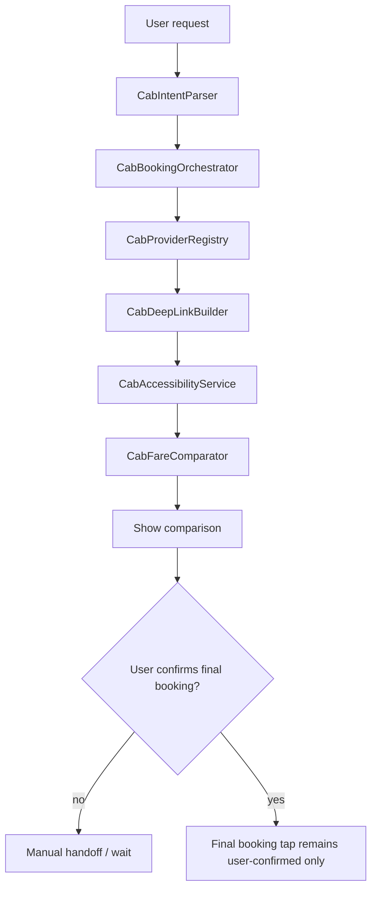

Current blocker status:

- Current-location pickup is blocked by missing location permission on the test phone.
- Manual pickup still depends on the provider app coming to the foreground and exposing destination fields.
- No automatic payment or OTP entry is allowed.

Important files:

- `app/src/main/java/com/nova/luna/cab/CabBookingModels.kt`
- `app/src/main/java/com/nova/luna/cab/CabIntentParser.kt`
- `app/src/main/java/com/nova/luna/cab/CabBookingOrchestrator.kt`
- `app/src/main/java/com/nova/luna/cab/CabProviderRegistry.kt`
- `app/src/main/java/com/nova/luna/cab/CabDeepLinkBuilder.kt`
- `app/src/main/java/com/nova/luna/cab/CabAccessibilityService.kt`
- `app/src/main/java/com/nova/luna/cab/CabBookingVoiceResponses.kt`
- `app/src/main/java/com/nova/luna/cab/CabFareComparator.kt`

## 11. Food Ordering Flow

Current code path:

- `FoodIntentParser` extracts food item, restaurant, quantity, provider preference, coupon preference, and platform comparison intent.
- `FoodBookingOrchestrator` runs the food state machine.
- `FoodProviderRegistry` detects installed food apps.
- `FoodDeepLinkBuilder` opens the provider app and injects search extras.
- `FoodAccessibilityService` tries to search, add, collect cart data, and read visible quote text.
- `FoodPriceComparator` normalizes and sorts quote data.
- `FoodCouponEngine` detects and applies coupon candidates.

Supported providers in code:

- Swiggy
- Zomato
- Toings

Current phone status from the latest manual test doc:

- Installed on the phone: Swiggy, Zomato
- Missing or unavailable in registry on that phone: Toings
- The supported provider screens did not expose usable search/cart controls in the latest deep rerun.

Flow states:

- IDLE
- NEED_FOOD_ITEM
- NEED_RESTAURANT
- OPENING_PROVIDERS
- COLLECTING_QUOTES
- SHOWING_COMPARISON
- WAITING_FOR_PLATFORM_CHOICE
- WAITING_FOR_FINAL_CONFIRMATION
- PREPARING_ORDER
- PLACING_ORDER
- COMPLETED
- FAILED
- CANCELLED
- MANUAL_ACTION_REQUIRED

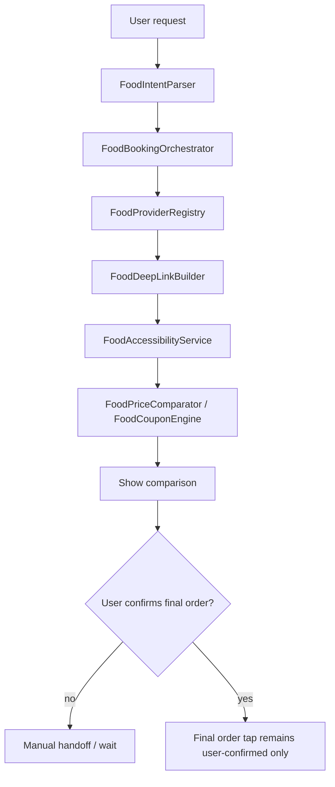

Current blocker status:

- Food is partial on the current phone because search/cart controls were not accessible.
- No payment, OTP, login, CAPTCHA, or final order automation is allowed.

Important files:

- `app/src/main/java/com/nova/luna/food/FoodBookingModels.kt`
- `app/src/main/java/com/nova/luna/food/FoodIntentParser.kt`
- `app/src/main/java/com/nova/luna/food/FoodBookingOrchestrator.kt`
- `app/src/main/java/com/nova/luna/food/FoodProviderRegistry.kt`
- `app/src/main/java/com/nova/luna/food/FoodDeepLinkBuilder.kt`
- `app/src/main/java/com/nova/luna/food/FoodAccessibilityService.kt`
- `app/src/main/java/com/nova/luna/food/FoodBookingVoiceResponses.kt`
- `app/src/main/java/com/nova/luna/food/FoodPriceComparator.kt`
- `app/src/main/java/com/nova/luna/food/FoodCouponEngine.kt`

## 12. Grocery Ordering Flow

Current code path:

- `GroceryIntentParser` strips wake words and parses basket items, quantities, brands, provider preferences, comparison cues, and coupon cues.
- `GroceryBookingOrchestrator` runs the grocery state machine.
- `GroceryProviderRegistry` detects installed Blinkit, JioMart, and Instamart packages.
- `GroceryDeepLinkBuilder` opens the provider app or search intent.
- `GroceryAccessibilityService` searches for items, adds them, applies safe coupons, reads cart totals, and captures unavailable/replacement items.
- `GroceryPriceComparator` compares cart candidates.
- `GroceryCouponEngine` finds and applies coupon candidates.

Supported providers in code:

- Blinkit
- JioMart
- Instamart

Current phone status from the latest manual test doc:

- Installed on the phone: Blinkit, JioMart, Instamart
- Grocery is the only provider flow that is currently green in the latest deep smoke results.

Flow states:

- IDLE
- PARSING_REQUEST
- NEED_ITEMS
- NEED_BRAND
- CHECKING_PROVIDERS
- OPENING_PROVIDER
- SEARCHING_PROVIDER
- ADDING_ITEMS
- APPLYING_COUPON
- COLLECTING_CART
- SHOWING_COMPARISON
- WAITING_FOR_PROVIDER_CHOICE
- WAITING_FOR_FINAL_CONFIRMATION
- BOOKING
- COMPLETED
- CANCELLED
- FAILED
- MANUAL_ACTION_REQUIRED

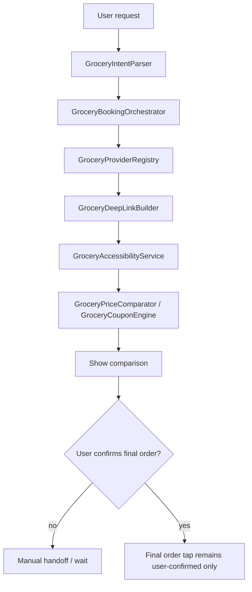

Current blocker status:

- Grocery is working best in the latest manual test results, but final checkout still stops before payment.
- Payment / OTP / login / CAPTCHA / address / replacement / unavailable-item screens remain human-only.

Important files:

- `app/src/main/java/com/nova/luna/grocery/GroceryBookingModels.kt`
- `app/src/main/java/com/nova/luna/grocery/GroceryIntentParser.kt`
- `app/src/main/java/com/nova/luna/grocery/GroceryBookingOrchestrator.kt`
- `app/src/main/java/com/nova/luna/grocery/GroceryProviderRegistry.kt`
- `app/src/main/java/com/nova/luna/grocery/GroceryDeepLinkBuilder.kt`
- `app/src/main/java/com/nova/luna/grocery/GroceryAccessibilityService.kt`
- `app/src/main/java/com/nova/luna/grocery/GroceryBookingVoiceResponses.kt`
- `app/src/main/java/com/nova/luna/grocery/GroceryPriceComparator.kt`
- `app/src/main/java/com/nova/luna/grocery/GroceryCouponEngine.kt`

## 13. Music App Flow

Status: NOT IMPLEMENTED.

What exists today:

- Generic `open app`, `tap`, `scroll`, `type`, and `go back` commands can still be used manually in music apps.
- There is no music-specific module or dedicated playback controller in the current code.

Planned flow:

- Voice request -> parse music intent -> safety gate -> open music app -> search/select track -> play/pause/next/previous -> manual confirmation for sensitive account actions.

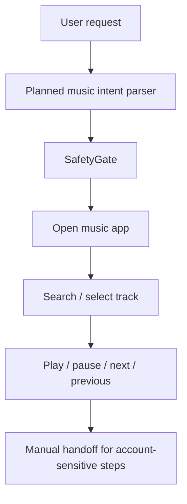

## 14. Video / Entertainment App Flow

Status: NOT IMPLEMENTED / PLANNED.

Current behavior:

- The general open-app and navigation commands can be used on YouTube, Instagram, Netflix, JioHotstar, and similar apps.
- There is no dedicated runtime for these apps yet.

Planned safe flow:

- Open app
- Search
- Scroll
- Select
- Play / pause
- Go back
- Stop before login, subscription upgrade, payment, purchase, or age-gated flows

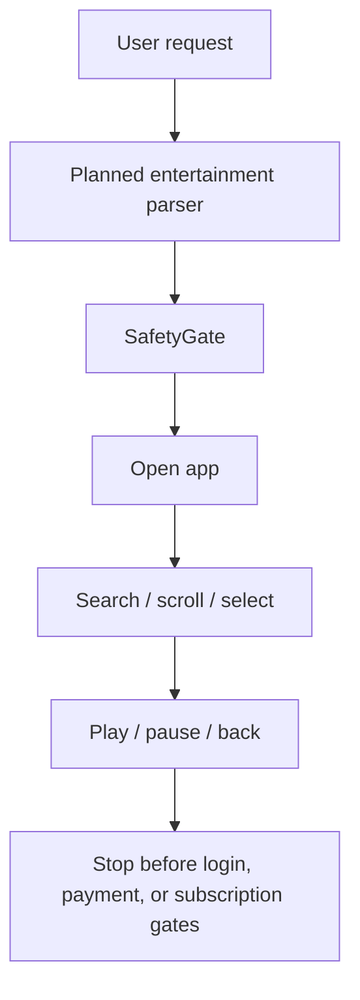

## 15. Online Shopping Flow

Status: PLANNED ONLY.

There is no dedicated online-shopping comparison engine in the current code. The current repo can only do generic browser/app launch and safe UI interaction primitives.

Planned workflow:

1. Ask for product intent.
2. Ask budget, purpose, brand, delivery preference, and payment preference.
3. Search multiple websites or apps.
4. Check trust signals and compare price, coupons, offers, delivery, warranty, and return policy.
5. Summarize the options in text and voice.
6. Ask for confirmation before any purchase step.
7. Block payment, OTP, CAPTCHA, and final checkout automation.

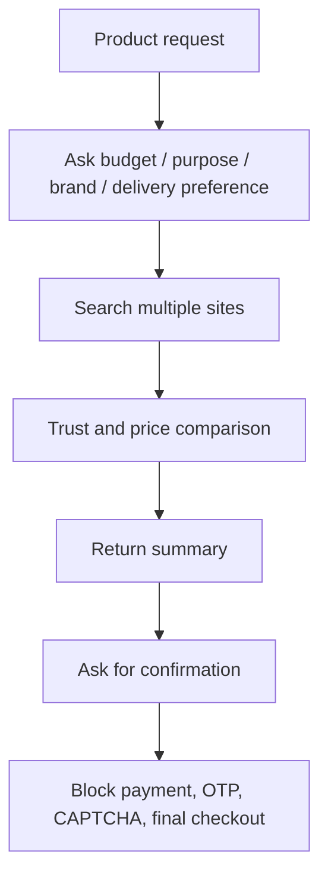

## 16. Voice and Personality System

Current implementation:

- `VoiceProfile` defines Nova and Luna.
- `TextToSpeechManager` applies the selected profile by changing pitch and speech rate.
- `PreferencesManager` stores the selected voice profile locally.
- `MainActivity` exposes a spinner for profile choice.
- `VoiceCommandService` keeps the profile active while listening and speaking.

What is implemented today:

- Nova and Luna are real selectable profiles in the UI and DataStore.
- The audible voice may still vary by device because Android TTS engine availability differs by phone.

What is not implemented yet:

- Deep personality adaptation beyond pitch/rate.
- Age / profession / temperament-aware speech style.
- Persona-specific long-form conversation style.
- Distinct Nova vs Luna behavioral policies beyond naming and voice tuning.

Planned work:

- Persona-aware prompt shaping.
- Voice style presets beyond pitch/rate.
- Response tone and phrasing differences.
- User-selectable personality profiles with local persistence.

## 17. Permissions and Android Runtime Requirements

| Permission / capability | Where it appears | Used for | Current status |
|---|---|---|---|
| `RECORD_AUDIO` | `app/src/main/AndroidManifest.xml` and `VoiceCommandService` | Speech input | Required |
| `FOREGROUND_SERVICE` | `app/src/main/AndroidManifest.xml` | Voice service lifecycle | Required |
| `FOREGROUND_SERVICE_MICROPHONE` | `app/src/main/AndroidManifest.xml` | Mic foreground service type | Required |
| `POST_NOTIFICATIONS` | `app/src/main/AndroidManifest.xml` and `MainActivity` | Foreground notification | Required on Android 13+ |
| `RECEIVE_BOOT_COMPLETED` | `app/src/main/AndroidManifest.xml` | Boot auto-start scaffold | Scaffolded |
| `USE_BIOMETRIC` | `app/src/main/AndroidManifest.xml` | Sensitive command gate | Scaffolded / used for gating |
| `QUERY_ALL_PACKAGES` | `app/src/main/AndroidManifest.xml` | App/provider discovery | Required for detection logic |
| `ACCESS_COARSE_LOCATION` | `app/src/main/AndroidManifest.xml` | Cab current-location pickup | Required for that flow |
| `ACCESS_FINE_LOCATION` | `app/src/main/AndroidManifest.xml` | Cab current-location pickup | Required for that flow |
| `BIND_ACCESSIBILITY_SERVICE` | Accessibility service declaration | Binding the assistant service | Required |
| Usage access | Settings / status checks | Future automation and status reporting | Scaffolded, missing on latest phone test |
| Wear `RECORD_AUDIO` | `wear/src/main/AndroidManifest.xml` | Watch mic relay | Required for watch scaffold |

Runtime dependencies by flow:

- Voice capture depends on microphone permission and a working speech recognizer.
- TTS depends on the installed Android TTS engine.
- Navigation / tapping / typing depend on the accessibility service being enabled and bound.
- Cab current-location pickup depends on location permission.
- Notification reading depends on notification access and accessibility service state.
- Boot auto-start is safe-by-default because the boot receiver is disabled in the manifest.

## 18. Provider App Detection

Cab provider detection:

| Provider | Package(s) in code | Current phone status |
|---|---|---|
| Uber | `com.ubercab` | Missing |
| Ola | `com.olacabs.customer` | Installed |
| Rapido | `com.rapido.passenger` | Installed |
| inDrive | `sinet.startup.inDriver`, `sinet.startup.indriver`, `com.indriver` | Missing |

Food provider detection:

| Provider | Package(s) in code | Current phone status |
|---|---|---|
| Swiggy | `in.swiggy.android` | Installed |
| Zomato | `com.application.zomato` | Installed |
| Toings | `com.toings.app`, `com.toings.android`, `com.toings.food` | Unavailable in latest deep rerun |

Grocery provider detection:

| Provider | Package(s) in code | Current phone status |
|---|---|---|
| Blinkit | `com.grofers.customerapp` | Installed |
| JioMart | `com.jpl.jiomart` | Installed |
| Instamart | `in.swiggy.android.instamart`, `in.swiggy.android` | Installed |

Missing provider behavior:

- Missing providers are skipped with a local reason like `app is not installed`.
- If a provider app cannot come to the foreground, the flow fails closed or falls back to another provider.
- If provider UI controls are inaccessible, the flow returns a manual-action or partial result instead of pretending success.

Special blockers:

- `BLOCKED_BY_PROVIDER_UI` is used when food apps are installed but search/cart controls are not accessible.
- `BLOCKED_BY_LOCATION_PERMISSION` is used when current-location cab pickup cannot proceed.

## 19. Testing and Validation

Important test groups in `app/src/test/java`:

- Brain routing, validation, and provider selection tests
- Cab parser, safety, provider registry, deep link, fare comparison, and accessibility tests
- Food parser, provider registry, coupon, price comparison, orchestration, and safety tests
- Grocery parser and safety tests
- DataStore preference tests
- Room command-history tests
- Voice profile tests
- Text normalization tests
- Flutter isolation test

Current validation commands documented in the repo:

```powershell
.\gradlew.bat :app:testDebugUnitTest --no-daemon
.\gradlew.bat :app:assembleDebug --no-daemon
.\gradlew.bat :app:installDebug --no-daemon
git diff --check
```

Latest known status from the repo docs:

- JVM unit tests passed in the latest documented validation.
- Debug build passed.
- Debug install passed on the connected phone in the latest manual report.
- Latest deep manual smoke on the phone was:
  - basic: PASS
  - cab: PARTIAL
  - food: PARTIAL
  - grocery: PASS
  - negative safety: PASS

Latest manual phone test date in the repo:

- `2026-06-05`

## 20. Current Known Blockers

- Location permission is missing on the latest test phone, so current-location cab pickup is blocked cleanly.
- Cab manual pickup still depends on provider foreground access and destination-field discovery.
- Food provider screens are installed but search/cart controls are not accessible on the latest test phone.
- Usage access is still missing on the latest test phone.
- Some provider apps are not installed on that phone, which limits comparison coverage.
- `PhoneGemmaRuntime` has no wired inference backend yet.
- `ScreenUnderstandingModel` is still a future read-only scaffold.
- `flutter_app/` is absent from this snapshot, so there is no Flutter runtime to validate here.
- Final payment, OTP, CAPTCHA, login, and checkout automation are intentionally blocked by design.

## 21. Completed Phases

| Phase / milestone | Evidence in code or docs | Status |
|---|---|---|
| Speech input and local TTS | `VoiceCommandService`, `TextToSpeechManager`, `MainActivity` | Completed |
| App launcher / open-app flow | `AppLauncher`, `RuleBasedCommandParser` | Completed |
| Accessibility navigation | `NovaAccessibilityService`, `NavExecutor` | Completed |
| Tap / scroll / type primitives | `TapExecutor`, `ScrollExecutor`, `TypeExecutor` | Completed |
| Command brain and routing | `CommandBrain`, `BrainService`, `BrainRouter`, `CommandRouter` | Completed |
| Safety gate | `SafetyGate`, safety tests, negative smoke cases | Completed |
| Cab provider orchestration | cab state machine, provider registry, deep-link builder, accessibility helper | Partial |
| Food provider orchestration | food state machine, provider registry, coupon engine, accessibility helper | Partial |
| Grocery provider orchestration | grocery state machine, provider registry, coupon engine, accessibility helper | Completed / green in latest smoke |
| Wear OS scaffold | `wear/` module and `shared/MessageChannels.kt` | Scaffolded |

The repo docs also preserve historical phase language such as phase 1 through phase 9 roadmaps. The practical current state is that the assistant core and safety model are in place, while provider reliability and future model/personality work remain open.

## 22. Remaining Roadmap

| Phase | Main tasks | Files likely affected | Risks | Validation |
|---|---|---|---|---|
| Phase 4: provider UI reliability hardening | Improve field discovery, provider-specific heuristics, timeouts, and fallbacks | cab/food/grocery accessibility and orchestrators | UI variance across OEMs and provider updates | Phone smoke on multiple devices and provider apps |
| Phase 5: robust screen understanding | Add read-only screen parsing and structured visual summaries | `ScreenUnderstandingModel`, accessibility helpers | Read-only model must never become an action path | Unit tests plus read-only smoke |
| Phase 6: local LLM integration | Wire a real on-device or local-LAN model path | `PhoneGemmaRuntime`, `GemmaBrainModel`, config/build files | Model size, performance, and safety regression | Device-level model readiness checks and validator tests |
| Phase 7: voice / personality engine | Add persona-aware speech style and response shaping | `TextToSpeechManager`, prompts, preferences, UI | Personality drift, inconsistent responses | UX tests and speech checks |
| Phase 8: online shopping comparison | Add trust and comparison workflow for shopping sites | new shopping module, safety, provider launch helpers | Scam surface and checkout risk | Safety tests and manual comparison smoke |
| Phase 9: entertainment / social app control | Add app-specific flows for YouTube, Instagram, Netflix, and similar apps | new app-specific modules | App UI variance and policy boundaries | Manual smoke with strict safety gates |
| Phase 10: wearable interface | Make the watch relay more complete | `wear/`, `shared/` | Pairing and UX fragmentation | Watch-device test loop |
| Phase 11: OEM / manufacturer-ready SDK | Package the assistant for device partners | module boundaries, docs, packaging | Scope creep and policy/security requirements | Release-readiness review and contract-style validation |

## 23. File-by-File Code Index

### Build and config

| File | Purpose | Main classes / functions | Related flow | Status |
|---|---|---|---|---|
| `build.gradle` | Root plugin versions | Gradle plugins | Build | core |
| `settings.gradle` | Module wiring | `:app`, `:wear`, `:shared` | Build | core |
| `app/build.gradle` | Android app build config | BuildConfig fields, dependencies | Build / brain config | core |
| `wear/build.gradle` | Wear app build config | Wear dependencies | Wear scaffold | core |
| `shared/build.gradle` | Shared module build config | shared constants | Phone/watch relay | core |
| `app/src/main/AndroidManifest.xml` | Phone app manifest | permissions, services, activities | Runtime | core |
| `app/src/debug/AndroidManifest.xml` | Debug smoke receivers | debug receivers | Validation | test |
| `wear/src/main/AndroidManifest.xml` | Wear manifest | watch feature, mic permission | Wear scaffold | core |
| `app/src/main/res/xml/accessibility_service_config.xml` | Accessibility service declaration | event types, flags | Accessibility | core |

### Core phone runtime

| File | Purpose | Main classes / functions | Related flow | Status |
|---|---|---|---|---|
| `app/src/main/java/com/nova/luna/MainActivity.kt` | Main control screen | permission prompts, voice profile spinner | App entry | core |
| `app/src/main/java/com/nova/luna/service/VoiceCommandService.kt` | Foreground speech loop | `VoiceCommandService` | Voice input | core |
| `app/src/main/java/com/nova/luna/service/NovaAccessibilityService.kt` | Shared accessibility service | `NovaAccessibilityService` | Accessibility | core |
| `app/src/main/java/com/nova/luna/service/NotificationHelper.kt` | Foreground notification helper | notifications and stop action | Voice service | core |
| `app/src/main/java/com/nova/luna/service/BootReceiver.kt` | Boot auto-start scaffold | boot receiver | Background startup | scaffold |
| `app/src/main/java/com/nova/luna/tts/TextToSpeechManager.kt` | Local TTS manager | `TextToSpeechManager` | Voice reply | core |
| `app/src/main/java/com/nova/luna/history/CommandHistoryActivity.kt` | History UI | `CommandHistoryActivity` | History | core |
| `app/src/main/java/com/nova/luna/history/CommandHistoryFormatter.kt` | History formatter | `format(...)` | History | core |

### Brain and model core

| File | Purpose | Main classes / functions | Related flow | Status |
|---|---|---|---|---|
| `app/src/main/java/com/nova/luna/brain/CommandBrain.kt` | User-facing orchestration | `CommandBrain.process(...)` | Main command loop | core |
| `app/src/main/java/com/nova/luna/brain/BrainService.kt` | Structured brain runtime | `process`, `diagnose` | Brain routing | core |
| `app/src/main/java/com/nova/luna/brain/BrainRouter.kt` | Selects model role | `route(...)` | Brain routing | core |
| `app/src/main/java/com/nova/luna/brain/CommandRouter.kt` | Final routing to executor | `route(...)` overloads | Safety / execution | core |
| `app/src/main/java/com/nova/luna/safety/SafetyGate.kt` | Final safety authority | `evaluate(...)` | Safety | core |
| `app/src/main/java/com/nova/luna/brain/BrainActionJsonCodec.kt` | JSON codec | `encode`, `decode` | Structured output | core |
| `app/src/main/java/com/nova/luna/brain/BrainActionValidator.kt` | Action validator | `isAcceptable(...)` | Structured output | core |
| `app/src/main/java/com/nova/luna/brain/BrainDiagnostics.kt` | Diagnostics | `BrainDiagnostics`, `BrainProviderTrace` | Debug smoke | core |
| `app/src/main/java/com/nova/luna/brain/BrainProviderFactory.kt` | Runtime selection | `create`, `createSelection` | Model selection | core |
| `app/src/main/java/com/nova/luna/brain/NetworkAwareBrainSelector.kt` | Capability-mode selection | `select(...)` | Runtime selection | core |
| `app/src/main/java/com/nova/luna/brain/InternetPermissionPolicy.kt` | Internet sensitivity policy | `classify(...)` | Safety / info lookup | core |
| `app/src/main/java/com/nova/luna/brain/BrainSystemPrompt.kt` | Local prompt | `build(...)` | Model output contract | core |
| `app/src/main/java/com/nova/luna/brain/LocalBrainInterpreter.kt` | Fallback interpreter | `interpret(...)` | Mock fallback | core |
| `app/src/main/java/com/nova/luna/brain/RuleBasedCommandParser.kt` | Direct parser | `parse(...)` | Command understanding | core |
| `app/src/main/java/com/nova/luna/brain/IntentResolver.kt` | App package resolution | `resolve(...)` | Open-app | core |

### Brain model / provider files

| File | Purpose | Main classes / functions | Related flow | Status |
|---|---|---|---|---|
| `app/src/main/java/com/nova/luna/brain/PhoneBrainModel.kt` | Phone-model interface | `PhoneBrainModel` | Model contract | core |
| `app/src/main/java/com/nova/luna/brain/PhoneBrainProvider.kt` | Provider interface | `PhoneBrainProvider` | Model contract | core |
| `app/src/main/java/com/nova/luna/brain/GemmaBrainModel.kt` | Gemma role wrapper | `GemmaBrainModel` | Future local model | scaffold |
| `app/src/main/java/com/nova/luna/brain/PhoneGemmaRuntime.kt` | Gemma readiness scaffold | `PhoneGemmaRuntime` | Future local model | scaffold |
| `app/src/main/java/com/nova/luna/brain/GemmaPhoneConfig.kt` | Gemma config | `GemmaPhoneConfig` | Future local model | scaffold |
| `app/src/main/java/com/nova/luna/brain/ActionJsonModel.kt` | Structured action planner | `ActionJsonModel` | Planning | core |
| `app/src/main/java/com/nova/luna/brain/LiteCommandModel.kt` | Simple command model | `LiteCommandModel` | Fast local commands | core |
| `app/src/main/java/com/nova/luna/brain/ScreenUnderstandingModel.kt` | Read-only future model | `ScreenUnderstandingModel` | Future screen understanding | planned |
| `app/src/main/java/com/nova/luna/brain/LocalMockBrainProvider.kt` | Guaranteed fallback | `LocalMockBrainProvider` | Offline fallback | core |
| `app/src/main/java/com/nova/luna/brain/LocalLlmBrainProvider.kt` | Ollama dev path | `LocalLlmBrainProvider` | Dev local LLM | planned |
| `app/src/main/java/com/nova/luna/brain/UnavailablePhoneBrainProvider.kt` | No-model stub | `UnavailablePhoneBrainProvider` | Fallback selection | core |
| `app/src/main/java/com/nova/luna/brain/OllamaClient.kt` | LLM client interface | `OllamaClient` | Dev local LLM | core |
| `app/src/main/java/com/nova/luna/brain/HttpOllamaClient.kt` | HTTP LLM client | `HttpOllamaClient` | Dev local LLM | planned |
| `app/src/main/java/com/nova/luna/brain/BrainRequest.kt` | Request wrapper | `BrainRequest` | Brain routing | core |
| `app/src/main/java/com/nova/luna/brain/BrainModelResult.kt` | Model result wrapper | `BrainModelResult` | Brain routing | core |

### Shared value objects

| File | Purpose | Main classes / functions | Related flow | Status |
|---|---|---|---|---|
| `app/src/main/java/com/nova/luna/model/ActionType.kt` | Executor action enum | `ActionType` | Command routing | core |
| `app/src/main/java/com/nova/luna/model/IntentType.kt` | Intent enum | `IntentType` | Command routing | core |
| `app/src/main/java/com/nova/luna/model/CommandIntent.kt` | Parsed command | `CommandIntent` | Command routing | core |
| `app/src/main/java/com/nova/luna/model/CommandResult.kt` | Final result | `CommandResult` | Command loop | core |
| `app/src/main/java/com/nova/luna/model/SafetyDecision.kt` | Safety result | `SafetyDecision` | Safety | core |
| `app/src/main/java/com/nova/luna/model/SafetyLevel.kt` | Safety level enum | `SafetyLevel` | Safety | core |
| `app/src/main/java/com/nova/luna/model/BrainAction.kt` | Structured candidate | `BrainAction` | Brain routing | core |
| `app/src/main/java/com/nova/luna/model/BrainActionType.kt` | Candidate action type | `BrainActionType` | Brain routing | core |
| `app/src/main/java/com/nova/luna/model/BrainModelRole.kt` | Brain role enum | `BrainModelRole` | Brain routing | core |
| `app/src/main/java/com/nova/luna/model/BrainRouteDecision.kt` | Routing decision | `BrainRouteDecision` | Brain routing | core |
| `app/src/main/java/com/nova/luna/model/BrainRuntimeStatus.kt` | Runtime snapshot | `BrainRuntimeStatus` | Brain diagnostics | core |
| `app/src/main/java/com/nova/luna/model/BrainRiskLevel.kt` | Risk enum | `BrainRiskLevel` | Brain routing | core |
| `app/src/main/java/com/nova/luna/model/BrainCapabilityMode.kt` | Capability mode enum | `BrainCapabilityMode` | Runtime config | core |
| `app/src/main/java/com/nova/luna/model/InternetPermissionCategory.kt` | Internet policy enum | `InternetPermissionCategory` | Internet policy | core |
| `app/src/main/java/com/nova/luna/model/InternetPermissionDecision.kt` | Internet policy result | `InternetPermissionDecision` | Internet policy | core |
| `app/src/main/java/com/nova/luna/model/VoiceProfile.kt` | Nova/Luna TTS profile | `VoiceProfile` | Voice system | core |

### Executor and utility files

| File | Purpose | Main classes / functions | Related flow | Status |
|---|---|---|---|---|
| `app/src/main/java/com/nova/luna/executor/ActionExecutor.kt` | Main action dispatcher | `ActionExecutor` | Execution | core |
| `app/src/main/java/com/nova/luna/executor/ActionExecutorGateway.kt` | Execution interface | `ActionExecutorGateway` | Execution | core |
| `app/src/main/java/com/nova/luna/executor/AppLauncher.kt` | Launch installed apps | `AppLauncher` | Open app | core |
| `app/src/main/java/com/nova/luna/executor/NavExecutor.kt` | Global navigation | `NavExecutor` | Navigation | core |
| `app/src/main/java/com/nova/luna/executor/TapExecutor.kt` | Tap-by-text | `TapExecutor` | Interaction | core |
| `app/src/main/java/com/nova/luna/executor/ScrollExecutor.kt` | Scroll actions | `ScrollExecutor` | Interaction | core |
| `app/src/main/java/com/nova/luna/executor/TypeExecutor.kt` | Type text | `TypeExecutor` | Text entry | core |
| `app/src/main/java/com/nova/luna/executor/SettingsExecutor.kt` | Open settings screens | `SettingsExecutor` | Settings | core |
| `app/src/main/java/com/nova/luna/executor/NotificationReader.kt` | Read latest notifications | `NotificationReader` | Notifications | core |
| `app/src/main/java/com/nova/luna/util/PermissionUtils.kt` | Permission checks | `PermissionUtils` | Runtime requirements | core |
| `app/src/main/java/com/nova/luna/util/AccessibilityReadiness.kt` | Accessibility readiness | `AccessibilityReadiness` | Runtime requirements | core |
| `app/src/main/java/com/nova/luna/util/AccessibilityNodeUtils.kt` | Node search helpers | `AccessibilityNodeUtils` | Accessibility | core |
| `app/src/main/java/com/nova/luna/util/AssistantTextNormalizer.kt` | Wake-word stripping and normalization | `AssistantTextNormalizer` | Parsing | core |
| `app/src/main/java/com/nova/luna/util/FuzzyMatcher.kt` | Fuzzy matching | `FuzzyMatcher` | App/provider lookup | core |

### Cab files

| File | Purpose | Main classes / functions | Related flow | Status |
|---|---|---|---|---|
| `app/src/main/java/com/nova/luna/cab/CabBookingModels.kt` | Cab state and data models | `CabBookingRequest`, `CabBookingSession`, `CabBookingResult` | Cab flow | core |
| `app/src/main/java/com/nova/luna/cab/CabIntentParser.kt` | Cab parsing | `CabIntentParser` | Cab flow | core |
| `app/src/main/java/com/nova/luna/cab/CabBookingOrchestrator.kt` | Cab session state machine | `CabBookingOrchestrator` | Cab flow | core |
| `app/src/main/java/com/nova/luna/cab/CabProviderRegistry.kt` | Cab provider discovery | `CabProviderRegistry` | Cab flow | core |
| `app/src/main/java/com/nova/luna/cab/CabDeepLinkBuilder.kt` | Cab app launch intents | `CabDeepLinkBuilder` | Cab flow | core |
| `app/src/main/java/com/nova/luna/cab/CabAccessibilityService.kt` | Cab screen inspector | `CabAccessibilityService` | Cab flow | core |
| `app/src/main/java/com/nova/luna/cab/CabLocationResolver.kt` | Current-location pickup resolution | `AndroidCabLocationResolver` | Cab flow | core |
| `app/src/main/java/com/nova/luna/cab/CabBookingVoiceResponses.kt` | Spoken cab prompts | helper object | Cab flow | core |
| `app/src/main/java/com/nova/luna/cab/CabFareComparator.kt` | Fare parsing and sorting | `CabFareComparator` | Cab flow | core |
| `app/src/main/java/com/nova/luna/cab/CabProviderLauncher.kt` | Launch wrapper | `CabProviderLauncher` | Cab flow | core |
| `app/src/main/java/com/nova/luna/cab/CabLogger.kt` | Cab logging | `CabLogger` | Cab flow | core |

### Food files

| File | Purpose | Main classes / functions | Related flow | Status |
|---|---|---|---|---|
| `app/src/main/java/com/nova/luna/food/FoodBookingModels.kt` | Food state and data models | `FoodBookingRequest`, `FoodBookingSession`, `FoodComparisonResult` | Food flow | core |
| `app/src/main/java/com/nova/luna/food/FoodIntentParser.kt` | Food parsing | `FoodIntentParser` | Food flow | core |
| `app/src/main/java/com/nova/luna/food/FoodBookingOrchestrator.kt` | Food session state machine | `FoodBookingOrchestrator` | Food flow | core |
| `app/src/main/java/com/nova/luna/food/FoodProviderRegistry.kt` | Food provider discovery | `FoodProviderRegistry` | Food flow | core |
| `app/src/main/java/com/nova/luna/food/FoodDeepLinkBuilder.kt` | Food app launch intents | `FoodDeepLinkBuilder` | Food flow | core |
| `app/src/main/java/com/nova/luna/food/FoodAccessibilityService.kt` | Food screen inspector | `FoodAccessibilityService` | Food flow | core |
| `app/src/main/java/com/nova/luna/food/FoodBookingVoiceResponses.kt` | Spoken food prompts | helper object | Food flow | core |
| `app/src/main/java/com/nova/luna/food/FoodPriceComparator.kt` | Quote parsing and sorting | `FoodPriceComparator` | Food flow | core |
| `app/src/main/java/com/nova/luna/food/FoodCouponEngine.kt` | Coupon discovery and application | `FoodCouponEngine` | Food flow | core |
| `app/src/main/java/com/nova/luna/food/FoodProviderLauncher.kt` | Launch wrapper | `FoodProviderLauncher` | Food flow | core |
| `app/src/main/java/com/nova/luna/food/FoodLogger.kt` | Food logging | `FoodLogger` | Food flow | core |

### Grocery files

| File | Purpose | Main classes / functions | Related flow | Status |
|---|---|---|---|---|
| `app/src/main/java/com/nova/luna/grocery/GroceryBookingModels.kt` | Grocery state and data models | `GroceryBookingRequest`, `GroceryBookingSession`, `GroceryBookingResult` | Grocery flow | core |
| `app/src/main/java/com/nova/luna/grocery/GroceryIntentParser.kt` | Grocery parsing | `GroceryIntentParser` | Grocery flow | core |
| `app/src/main/java/com/nova/luna/grocery/GroceryBookingOrchestrator.kt` | Grocery session state machine | `GroceryBookingOrchestrator` | Grocery flow | core |
| `app/src/main/java/com/nova/luna/grocery/GroceryProviderRegistry.kt` | Grocery provider discovery | `GroceryProviderRegistry` | Grocery flow | core |
| `app/src/main/java/com/nova/luna/grocery/GroceryDeepLinkBuilder.kt` | Grocery app launch intents | `GroceryDeepLinkBuilder` | Grocery flow | core |
| `app/src/main/java/com/nova/luna/grocery/GroceryAccessibilityService.kt` | Grocery screen inspector | `GroceryAccessibilityService` | Grocery flow | core |
| `app/src/main/java/com/nova/luna/grocery/GroceryBookingVoiceResponses.kt` | Spoken grocery prompts | helper object | Grocery flow | core |
| `app/src/main/java/com/nova/luna/grocery/GroceryPriceComparator.kt` | Cart comparison | `GroceryPriceComparator` | Grocery flow | core |
| `app/src/main/java/com/nova/luna/grocery/GroceryCouponEngine.kt` | Coupon discovery and application | `GroceryCouponEngine` | Grocery flow | core |
| `app/src/main/java/com/nova/luna/grocery/GroceryProviderLauncher.kt` | Launch wrapper | `GroceryProviderLauncher` | Grocery flow | core |
| `app/src/main/java/com/nova/luna/grocery/GroceryLogger.kt` | Grocery logging | `GroceryLogger` | Grocery flow | core |

### Data and history

| File | Purpose | Main classes / functions | Related flow | Status |
|---|---|---|---|---|
| `app/src/main/java/com/nova/luna/data/PreferencesManager.kt` | Local DataStore preferences | voice profile, wake phrase, assistant enabled, auto-start | Preferences | core |
| `app/src/main/java/com/nova/luna/data/AppDatabase.kt` | Local Room database | `AppDatabase` | Persistence | core |
| `app/src/main/java/com/nova/luna/data/CommandHistoryEntity.kt` | History entity | `CommandHistoryEntity` | Persistence | core |
| `app/src/main/java/com/nova/luna/data/CommandHistoryDao.kt` | History DAO | `CommandHistoryDao` | Persistence | core |
| `app/src/main/java/com/nova/luna/data/CommandHistoryRecordFactory.kt` | History mapper | `buildCommandHistoryEntity(...)` | Persistence | core |
| `app/src/main/java/com/nova/luna/data/CustomRuleEntity.kt` | Custom rule entity | `CustomRuleEntity` | Future rules | scaffold |
| `app/src/main/java/com/nova/luna/data/CustomRuleDao.kt` | Custom rule DAO | `CustomRuleDao` | Future rules | scaffold |

### Debug smoke and tests

| File group | Purpose | Status |
|---|---|---|
| `app/src/debug/java/com/nova/luna/brain/BrainSmokeReceiver.kt`, `BrainSmokePhraseCatalog.kt`, `BrainSmokeLogger.kt` | Brain debug smoke | test |
| `app/src/debug/java/com/nova/luna/cab/CabSmokeReceiver.kt` | Cab debug smoke | test |
| `app/src/debug/java/com/nova/luna/smoke/CommandSmokeReceiver.kt` | Sectioned command smoke | test |
| `app/src/test/java/com/nova/luna/brain/*` | Brain routing, validator, provider, parser, and isolation tests | test |
| `app/src/test/java/com/nova/luna/cab/*` | Cab parser, provider, comparator, safety, and accessibility tests | test |
| `app/src/test/java/com/nova/luna/food/*` | Food parser, provider, comparator, coupon, and accessibility tests | test |
| `app/src/test/java/com/nova/luna/grocery/*` | Grocery parser tests | test |
| `app/src/test/java/com/nova/luna/data/*` | DataStore and Room tests | test |
| `app/src/test/java/com/nova/luna/history/*` | History formatter and DAO tests | test |
| `app/src/test/java/com/nova/luna/model/*` | Voice profile tests | test |
| `app/src/test/java/com/nova/luna/safety/*` | SafetyGate tests for food and grocery | test |
| `app/src/test/java/com/nova/luna/util/*` | Text normalization tests | test |

### Docs

| File | Purpose | Status |
|---|---|---|
| `docs/ARCHITECTURE.md` | Historical architecture overview | docs |
| `docs/CURRENT_ARCHITECTURE_REPORT.md` | Prior architecture snapshot | docs |
| `docs/WORK_PROCESS_REPORT.md` | Process / readiness snapshot | docs |
| `docs/WORK_AND_PROCESS_REPORT.md` | Process and phase notes | docs |
| `docs/ROADMAP.md` | Older roadmap phases | docs |
| `docs/PHONE_ONLY_RUNTIME.md` | Runtime-mode notes | docs |
| `docs/SECURITY_AND_LIMITATIONS.md` | Safety and policy limits | docs |
| `docs/MANUAL_PHONE_TEST_RESULTS.md` | Latest detailed phone smoke results | docs |
| `docs/MANUAL_PHONE_TEST_CHECKLIST.md` | Manual validation checklist | docs |
| `docs/NOVA_LUNA_PROGRESS_CHECKPOINT.md` | Earlier verified checkpoint | docs |
| `docs/FINAL_ANDROID_NATIVE_RELEASE_READINESS_REPORT.md` | Historical release snapshot | docs |
| `docs/NOVA_LUNA_A_TO_Z_PROJECT_REPORT.md` | Prior full report | docs |
| `docs/NOVA_LUNA_FULL_ARCHITECTURE_AND_WORKFLOW_REPORT.md` | This report | docs |
| `docs/NOVA_LUNA_PROJECT_SHORT_SUMMARY.md` | Companion summary | docs |
| `docs/NOVA_LUNA_FLOWCHARTS.md` | Diagram-only companion file | docs |

### Wear and shared

| File | Purpose | Main classes / functions | Related flow | Status |
|---|---|---|---|---|
| `shared/src/main/java/com/nova/luna/shared/MessageChannels.kt` | Wear message paths | `MessageChannels` | Wear relay | core |
| `wear/src/main/java/com/nova/luna/wear/WearMainActivity.kt` | Wear UI | `WearMainActivity` | Wear relay | scaffold |
| `wear/src/main/java/com/nova/luna/wear/WearVoiceHandler.kt` | Wear speech capture | `WearVoiceHandler` | Wear relay | scaffold |
| `wear/src/main/java/com/nova/luna/wear/PhoneRelayService.kt` | Watch-to-phone relay | `PhoneRelayService` | Wear relay | scaffold |

## 24. End-to-End Mermaid Diagrams

### 24.1 Full assistant runtime flow

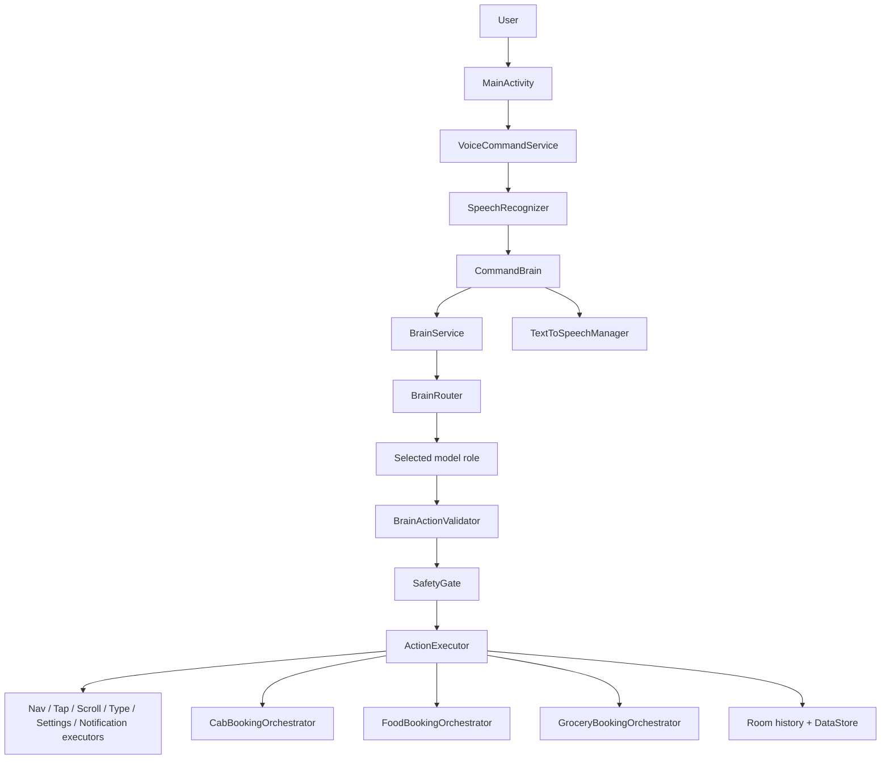

### 24.2 Brain safety execution flow

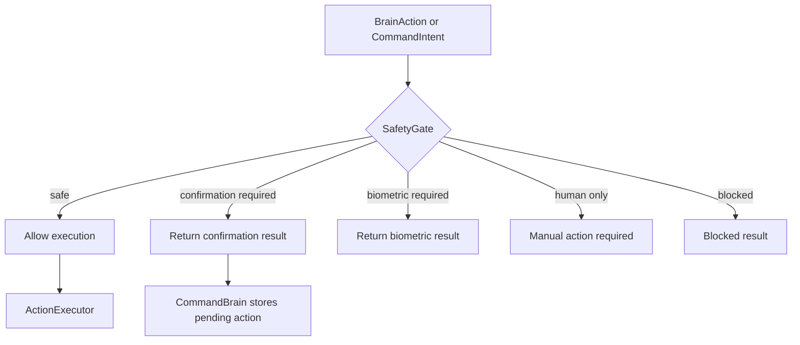

### 24.3 Cab booking flow

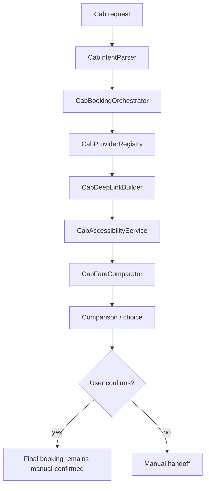

### 24.4 Food order flow

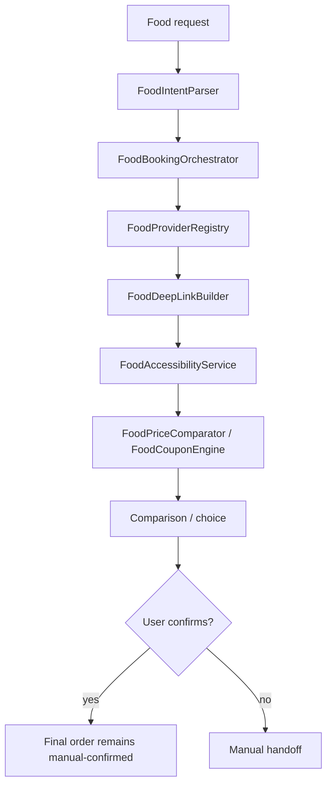

### 24.5 Grocery order flow

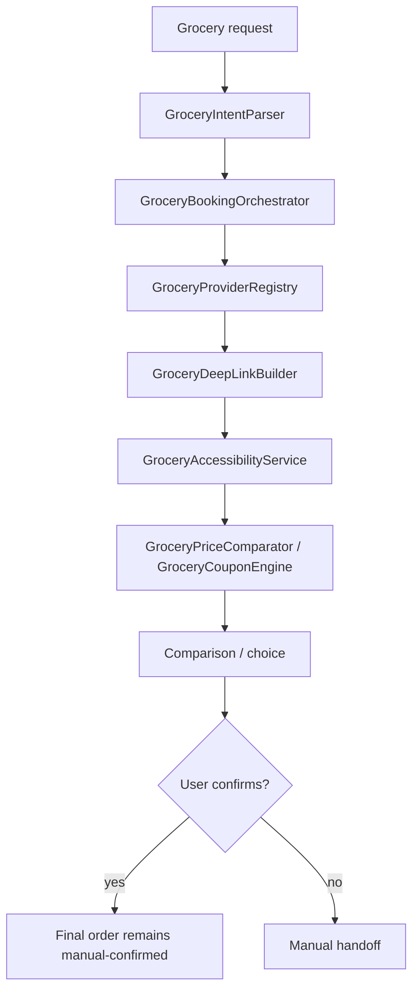

### 24.6 Online shopping planned flow

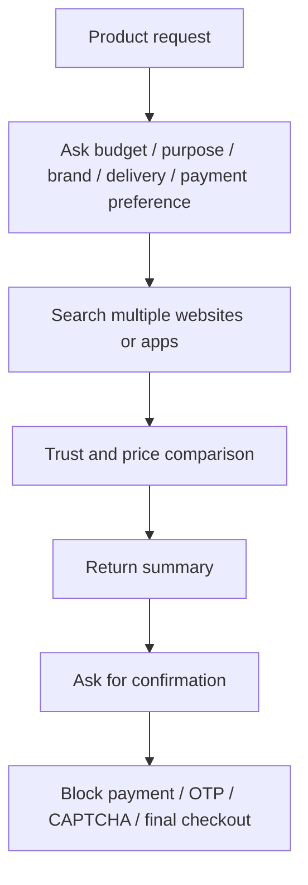

### 24.7 Entertainment / social planned flow

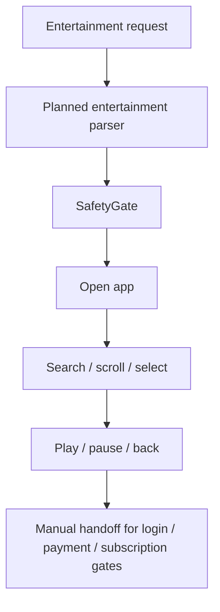

### 24.8 OEM / wearable future architecture

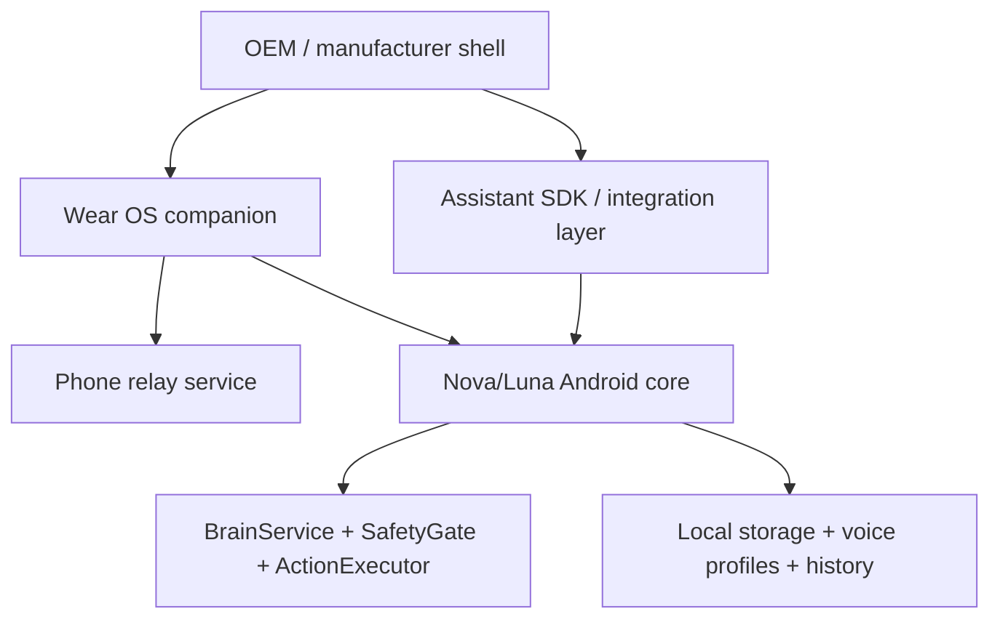

## 25. Final Project Status

What works now:

- Local voice capture with a foreground service.
- Local TTS replies.
- Nova/Luna voice profile selection.
- Open app, navigation, tap, scroll, type, settings, and notification primitives.
- Structured brain routing and safety gating.
- Cab, food, and grocery session orchestration.
- Local history and preferences.
- Wear OS relay scaffold.

What partially works:

- Cab provider handoff and comparison on real devices.
- Food provider handoff and comparison on real devices.
- Brain provider selection beyond the mock fallback.
- Persona expression beyond simple TTS tuning.

What is blocked:

- Current-location cab pickup on the latest test phone because location permission is missing.
- Food search/cart automation on the latest test phone because provider controls are not accessible.
- Real phone-local Gemma inference because the backend is not wired yet.
- Any payment, OTP, CAPTCHA, or final checkout automation by design.

What is planned:

- Stronger provider UI reliability.
- Read-only screen understanding.
- Real local model integration.
- Persona-aware voice and behavior.
- Online shopping comparison.
- Entertainment / social app control.
- Wearable growth.
- OEM / partner SDK direction.

What must be done before a demo:

- Resolve location permission for cab current-location tests.
- Make provider UI discovery more reliable for cab and food.
- Keep negative safety tests green.
- Validate on at least one more real phone if possible.

What must be done before a real public or OEM product:

- Wire a real local model path and keep it validator-bound.
- Expand safety, policy, and logging coverage.
- Harden provider reliability across OEMs and app versions.
- Add clearer persona behavior and UX polish.
- Validate privacy, permissions, and policy boundaries carefully.
